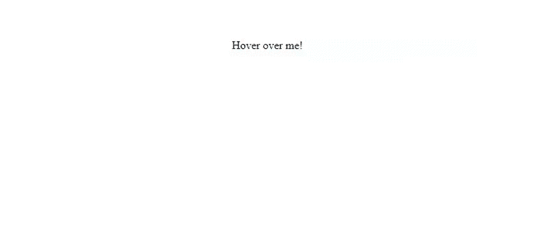

# 如何使用 CSS3 和 jQuery 创建链接工具提示？

> 原文:[https://www . geesforgeks . org/how-create-link-tooltip-using-css3-and-jquery/](https://www.geeksforgeeks.org/how-to-create-link-tooltip-using-css3-and-jquery/)

当一个元素或链接被悬停时，链接工具提示是显示额外信息的好方法。有几种方法可以做到这一点。

**使用 CSS 和 jQuery:** 在 jQuery 中使用 mousenter 和 mouseleave 事件来执行这个操作。

```css
<!DOCTYPE html>
<html>

<head>
    <style>
        .tooltip {
            display: none;
            position: absolute !important;
            width: 200px;
            padding: 10px;
            margin: 0 0 3px 0;
            color: #fff;
            z-index: 1;
            font-size: 50px;
            text-decoration: none;
            text-align: center;
        }

        .tooltip:after {
            position: absolute !important;
            bottom: -14px;
            z-index: 1;
        }

        .tooltip:before {
            content: "";
            position: absolute !important;
            bottom: -14px;
            z-index: 100;
        }
    </style>

</head>

<body>
    <a href="#" class="link" title="Hello world!"
            class="tooltip_link left">
        Hover over me!
    </a>

    <script>
        $("a").mouseenter(function (e) {
            var $x = e.pageX - this.offsetLeft;
            var $tooltip_text = $(this).attr("title");

            $(this).append('<div class="tooltip">' 
                    + $tooltip_text + '</div>');
            $("a > div.tooltip.").fadeIn(300);

        });

        $("a").mouseleave(function () {
            $("a > div.tooltip.").fadeOut(300)
                    .delay(300)(function () {
                $(this).remove();
            });
        });
    </script>
</body>

</html>
```

**输出:**


鼠标悬停在“悬停在我身上！”，输出为

```css
Hello world!
```

**使用 jQuery UI:**jQuery UI 的工具提示小部件有助于自定义工具提示。tooltip()方法用于向任何元素添加工具提示。

```css
<!DOCTYPE html>
<html lang="en">

<head>

    <!-- jQuery Links -->
    <link href=
"https://code.jquery.com/ui/1.10.4/themes/ui-lightness/jquery-ui.css"
        rel="stylesheet">

    <script src=
"https://code.jquery.com/jquery-1.10.2.js">
    </script>

    <script src=
"https://code.jquery.com/ui/1.10.4/jquery-ui.js">
    </script>

    <style type="text/css">
        .example {
            padding-left: 2rem !important;
            margin-top: 3rem;
            text-decoration: none;
            color: green;

        }
    </style>
</head>

<body>
    <a class="example" id="myTooltip" 
            href="#" title="Hello world!">
        Hover Over me!
    </a>

    <script>
        $(function () {
            $("#myTooltip").tooltip();
        });
    </script>
</body>

</html>
```

**输出:**


**仅使用 CSS:**工具提示可以使用 CSS 创建，并且可以像任何其他元素一样进行自定义。

```css
<!DOCTYPE html>
<html>

<head>
    <style>
        body {
            text-align: center;
        }

        .tooltip {
            position: relative;
            display: inline-block;
            margin-top: 3rem;
        }

        .tooltip .tooltiptext {
            width: 8rem;
            text-align: center;
            border-radius: 4px;
            background-color: green;
            color: #fff;
            padding-top: 9px;
            padding-bottom: 9px;
            position: absolute;
            z-index: 1;
            bottom: 165%;
            margin-left: -55px;
            left: 50%;
            transition: opacity 0.5s;
            visibility: hidden;
        }

        .tooltip .tooltiptext::after {
            content: "";
            position: absolute;
            top: 100%;
            left: 50%;
            margin-left: -5px;
            border-width: 5px;
            border-style: solid;
            border-color: green 
                transparent transparent;
        }

        .tooltip:hover .tooltiptext {
            visibility: visible;
        }
    </style>
</head>

<body>
    <div class="tooltip">Hover over me!
        <span class="tooltiptext">
            Hello world!
        </span>
    </div>
</body>

</html>
```

**输出:**

