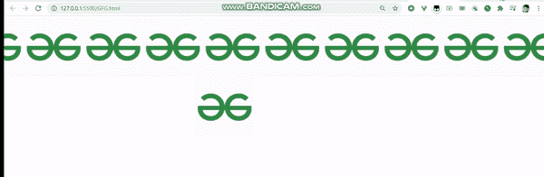
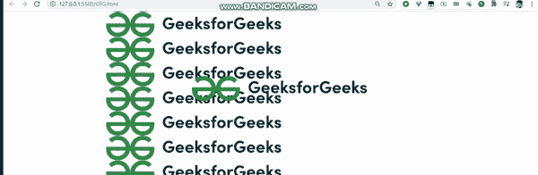

# 如何在 CSS 中创建多个背景图像视差？

> 原文:[https://www . geeksforgeeks . org/如何创建多背景图像-css 中的视差/](https://www.geeksforgeeks.org/how-to-create-multiple-background-image-parallax-in-css/)

在这篇文章中，我们将学习如何在 CSS 中创建多个背景图像视差。

**方法:**首先，我们将使用 CSS 中的背景图像属性添加背景图像。我们可以使用背景图像添加多个图像。

**语法:**

```
background-image: url(image_url1),url(image_url2),...;
```

然后我们在 CSS 中应用动画属性来制作图像动画。

**语法:**

```
animation: duration timing-function iteration-count direction;
```

以下是上述方法的全面实施:

**例 1:**

## 超文本标记语言

```
<!DOCTYPE html>
<html lang="en">
  <head>
    <style>
      html {
        /* Add background image */
        background-image: url("gfg_stiker.png");
        /* Repeat image in x-axis  */
        background-repeat: repeat-x;
        /* Animate Using animation: duration
           timing-function iteration-count direction; */
        animation: 30s parallel infinite linear;
      }
      /* timing-function */
      @keyframes parallel {
        100% {
          /* set background-position */
          background-position: -5000px 20%;
        }
      }
    </style>
  </head>
  <body>
    <div id="rocket">
    
  </div>
  </body>
</html>
```

**输出:**



**例 2:**

## 超文本标记语言

```
<!DOCTYPE html>
<html lang="en">
  <head>
    <style>
      html {
        /* Add background image */
        background-image: url("gfg_complete_logo_2x-min.png");
        /* Repeat image in y-axis  */
        background-repeat: repeat-y;
        /* Animate Using animation: duration
           timing-function iteration-count direction; */
        animation: 30s parallel infinite linear;
      }
      /* timing-function */
      @keyframes parallel {
        100% {
          /* set background-position */
          background-position: 5000px 20%;
        }
      }
    </style>
  </head>
  <body>
    <div id="rocket">
    
  </div>
  </body>
</html>
```

**输出:**

