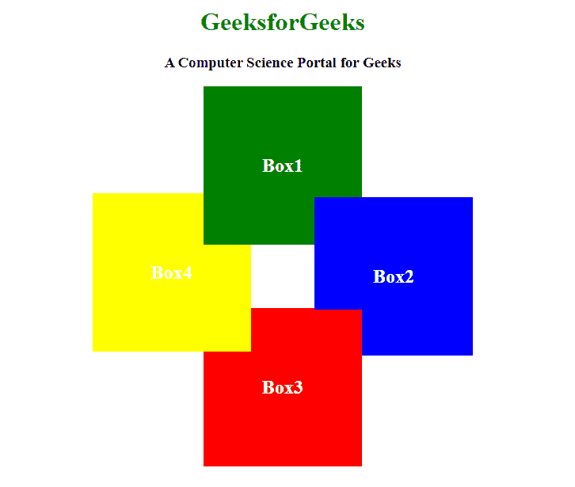
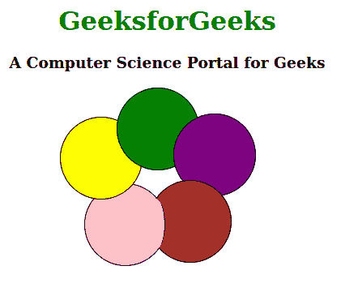

# 如何用 CSS 创造悖论效果？

> 原文:[https://www . geeksforgeeks . org/如何使用-css/](https://www.geeksforgeeks.org/how-to-create-paradoxical-effect-using-css/) 创造-矛盾-效果

自相矛盾的效果是指草皮或元素以圆形的形式相互叠加的效果。当您想要设计一个当您悬停时打开的圆形按钮，并且每个按钮都像顶部一样分配一些任务和位置时，这种效果非常有用。
在下面的例子中，我们将使用 z-index。像这样的放置需要精通位置属性和顶部、左侧、右侧和底部属性。然后你可以很容易地设计出自相矛盾的效果。

下面的例子说明了产生矛盾效果的方法:

**例 1:**

```css
<!DOCTYPE html>
<html>

<head>
    <title>Paradoxical effect by HTML and CSS</title>

    <style>
        h1 {
            color: green;
        }

        div {
            height: 200px;
            width: 200px;
            line-height: 200px;
            color: white;
            font-size: 24px;
            font-weight: bold;
        }

        .box1 {
            position: relative;
            background-color: green;
            z-index: 3;
        }

        .box2 {
            position: relative;
            left: 140px;
            top: -60px;
            background-color: blue;
            z-index: 3;
        }

        .box2:before {
            content: '';
            position: absolute;
            bottom: -2px;
            left: -2px;
            width: 62px;
            height: 60px;
            z-index: 14;
            background-color: red;
        }

        .box3 {
            position: relative;
            left: 0;
            top: -120px;
            background-color: red;
            z-index: 1;
        }

        .box4 {
            position: relative;
            left: -140px;
            top: -465px;
            background-color: yellow;
            z-index: 2;
        }
    </style>    
</head>

<body>
    <center>
        <h1>GeeksforGeeks</h1>
        <h3>A Computer Science Portal for Geeks</h3>
        <div class="box1">Box1</div>
        <div class="box2">Box2</div>
        <div class="box3">Box3</div>
        <div class="box4">Box4</div>
    </center>
</body>

</html>
```

**输出:**


**例 2:**

```css
<!DOCTYPE html>
<html>

<head>
    <title>
        Paradoxical effect
        by HTML and CSS
    </title>

    <style>
        h1 {
            color: green;
        }

        div {
            height: 100px;
            width: 100px;
            border: solid 1px;
            border-radius: 50%;
        }

        .Circle1 {
            position: relative;
            left: 0px;
            background-color: green;
            z-index: 1;
        }

        .Circle2 {
            position: relative;
            left: 70px;
            top: -70px;
            background-color: purple;
            z-index: 2;
        }

        .Circle3 {
            position: relative;
            left: 40px;
            top: -90px;
            background-color: brown;
            z-index: 3;
        }

        .Circle3:before {
            content: '';
            position: absolute;
            bottom: 15px;
            left: -5px;
            width: 22px;
            height: 62.9px;
            border-right: 1px solid black;
            z-index: 20;
            background-color: pink;
            border-radius: 50%;

        }
        .Circle4 {
            position: relative;
            left: -70px;
            top: -270px;
            background-color: yellow;
            z-index: -1;
        }

        .Circle5 {
            position: relative;
            left: -40px;
            top: -290px;
            background-color: pink;
            z-index: -2;
        }
        div {
            text-align: center;
        }
    </style>
</head>

<body>
    <center>
        <h1>GeeksforGeeks</h1>
        <h3>
            A Computer Science Portal for Geeks
        </h3>
        <div class="Circle1"></div>
        <div class="Circle2"></div>
        <div class="Circle3"></div>
        <div class="Circle4"></div>
        <div class="Circle5"></div>
    </center>
</body>

</html>
```

**输出:**
