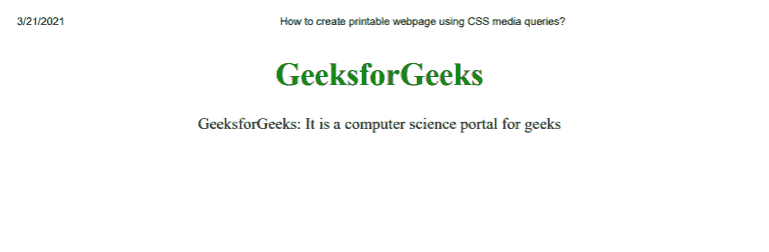
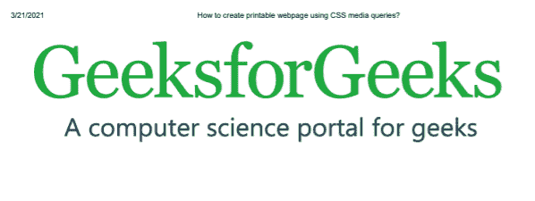

# 如何使用 CSS 媒体查询创建可打印的网页？

> 原文:[https://www . geesforgeks . org/如何创建-可打印-网页-使用-CSS-媒体-查询/](https://www.geeksforgeeks.org/how-to-create-printable-webpage-using-css-media-queries/)

媒体查询用于在打印网页时隐藏/显示元素。使用@media print 查询，并将可见性属性设置为打印时需要隐藏/显示的元素。在本文中，我们使用媒体查询和可见性属性来打印网页。

**示例 1:** 在本例中，我们将在打印时打印主体元素。若要隐藏正文元素，请将“可见性”属性设置为在打印媒体查询中隐藏。

## 超文本标记语言

```css
<!DOCTYPE html>
<html>

<head>
    <title>
        How to create printable webpage
        using CSS media queries?
    </title>

    <style>
        body {
            text-align: center;
        }

        h1 {
            color: green;
        }

        @media print {
            .noprint {
                visibility: visible;
            }
        }
    </style>
</head>

<body class="noprint">
    <h1>GeeksforGeeks</h1>

    <p>
        GeeksforGeeks: It is a computer
        science portal for geeks
    </p>

</body>

</html>
```

**输出:**



**示例 2:** 在本例中，我们将在打印时打印主体元素。若要隐藏正文元素，请将“可见性”属性设置为在打印媒体查询中隐藏。

## 超文本标记语言

```css
<!DOCTYPE html>
<html>

<head>
    <title>
        How to create printable webpage
        using CSS media queries?
    </title>

    <style>
        body {
            text-align: center;
        }

        @media print {
            .noprint {
                visibility: visible;
            }
        }
    </style>
</head>

<body class="noprint">
    
</body>

</html>
```

**输出:**

