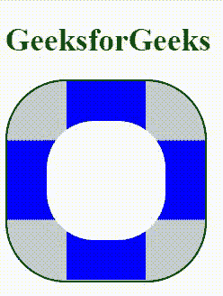
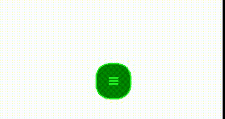

# 如何在 CSS 中创建放射状菜单？

> 原文:[https://www . geesforgeks . org/how-create-radial-menu-in-CSS/](https://www.geeksforgeeks.org/how-to-create-radial-menu-in-css/)

使用 CSS 属性创建径向菜单的方法有很多。放射状菜单中使用字体图标、字母和/或图像。那个重拨按钮可以和网站链接。使用 CSS 设置径向按钮的位置、高度和宽度。还有另一种使用 JavaScript 创建放射状菜单的方法。

**示例 1:** 本示例使用 CSS 属性创建放射状菜单。

```css
<!DOCTYPE html>
<html>

<head>
    <title>
        Creating Radial Menu
    </title>

    <!-- CSS style to create radial menu -->
    <style>

        /* Set the style of div */
        div {
            display:inline-block;
            height:200px;
            width:200px;
            background:#d1d1d1;
            border-radius:30%;
            position:relative;
            overflow:hidden;
            border:2px solid black;
        }
        div:before {
            content:"";
            position:absolute;
            height:60%;
            width:60%;
            border-radius:40%;
            background:white;
            top:20%;
            left:20%;
            z-index:8;
        }
        div a {
            position:absolute;
            padding:40px;
            background:blue;
            padding-bottom:50px;
        }

        /* Set the position of button */
        div a:nth-child(1){
            bottom:-10%;
            left:50%;
            transform:translateX(-50%);
        }

        /* Set the position of button */
        div a:nth-child(2){
            bottom:28%;
            left:10%;
            transform:translateX(-50%) rotate(90deg);
        }

        /* Set the position of button */
        div a:nth-child(3){
            bottom:28%;
            left:90%;
            transform:translateX(-50%) rotate(-90deg);
        }

        /* Set the position of button */
        div a:nth-child(4) {
            bottom:60%;
            left:50%;
            transform:translateX(-50%);
        }

        /* Set style when mouse move over */
        div a:hover {
            background:green;
    </style>
</head>

<!-- body part of document -->
<body>
    <h1 style="color:Green;">
        GeeksforGeeks
    </h1>

    <div>
        <a href="#"></a>
        <a href="#"></a>
        <a href="#"></a>
        <a href="#"></a>
    </div>
</body>

</html>                                     
```

**输出:**


**示例 2:** 本示例使用字体图标和 CSS 属性创建放射状菜单。

```css
<!DOCTYPE html>
<html>

<head>
    <title>
        Creating Radial Menu
    </title>

    <link rel="stylesheet" href=
"https://netdna.bootstrapcdn.com/font-awesome/4.3.0/css/font-awesome.min.css"> 

    <!-- CSS style to create radial menu -->
    <style>
        #check { 
            display: none;
        }

        /* Set the icon width, height and position */
        .main,.icons {
            margin: auto;
            position:absolute;
            top: 0;
            right: 0;
            bottom: 0;
            left: 0;
            width: 50px;
            height: 50px;
            border-radius: 40%;
        }

        /* Set the style of menu button */
        .main {
            background-color: gray;
            cursor: pointer;
            z-index: 50;
        }

        /* Set the position, height and 
            width of menu button */
        .main .title {
            margin: auto;
            position: absolute;
            top: 0;
            right: 0;
            bottom: 0;
            left: 0;
            width: 100%;
            height: 80px;
            font-size: 16px;
            line-height: 80px;
            text-align: center;
            color: lime;
        }

        /* Set position, height and width 
            of buttons */
        .button {
            margin: auto;
            position: absolute;
            top: 0;
            right: 0;
            bottom: 0;
            left: 0;
            width: 45px;
            height: 45px;
            border-radius: 40%;
            transition: all 0.4s ease-in;
        }
        .button i {
            width: 100%;
            font-size: 20px;
            line-height: 50px;
            text-align: center;
            color: white;
        }
        .main {
            border:2px solid lime;
        }
        .button {
            border:2px solid black;
        }

        /* Positioning of buttons */
        #check:checked ~ .main + .icons .button {
            opacity:0.8;
        }
        #check:checked ~ .main + .icons .button:nth-of-type(1) {
            top: -100%;
            left: -480%;
            background-color: green;
            transition-delay:0.6s;
        }
        #check:checked ~ .main + .icons .button:nth-of-type(2) {
            top: -230%;
            left: -250%;
            background-color: green;
            transition-delay:0.4s;
        }
        #check:checked ~ .main + .icons .button:nth-of-type(3) {
            top: -280%;
            background-color: green;
            transition-delay:0.2s;
        }
        #check:checked ~ .main + .icons .button:nth-of-type(4) {
            top: -230%;
            right: -250%;
            background-color: green;
            transition-delay:0.4s;
        }
        #check:checked ~ .main + .icons .button:nth-of-type(5) {
            top: -100%;
            right: -480%;
            background-color: green;
            transition-delay:0.6s;
        }
    </style>
</head>

<body>
    <input id="check" type="checkbox">

    <label class="main" for="check">
        <div class="title">
            <i class="fa fa-bars"></i>
        </div>
    </label>

    <!--Buttons that link with the other pages -->
    <div class="icons">
        <a class="button" href="#" >
            <i class="fa fa-youtube"></i>
        </a>
        <a class="button" href="#" >
            <i class="fa fa-facebook"></i>
        </a>
        <a class="button" href="h#">
            <i class="fa fa-linkedin"></i>
        </a>
        <a class="button" href="#">
            <i class="fa fa-github"></i>
        </a>
        <a class="button" href="#">
            <i class="fa fa-google-plus"></i>
        </a>
    </div>
</body>

</html>                                    
```

**输出:**
