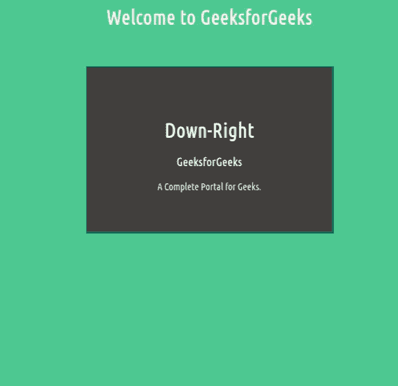
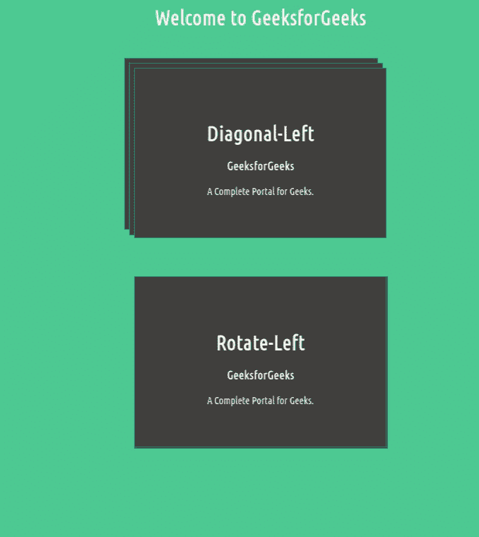
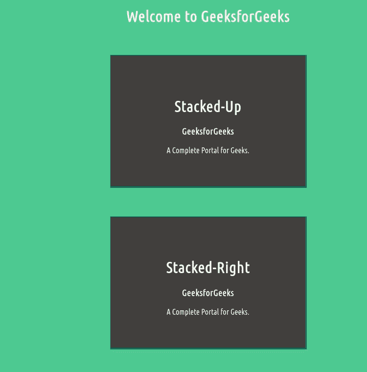

# 如何使用 CSS 创建反应灵敏的叠卡悬停效果？

> 原文:[https://www . geesforgeks . org/how-create-responsive-stacked-cards-hover-effect-use-CSS/](https://www.geeksforgeeks.org/how-to-create-responsive-stacked-cards-hover-effect-using-css/)

**简介:**卡片是任何网站非常重要的一部分。它用于向观众简短地显示一些重要信息。在本文中，我们将使用 HTML 和 CSS 创建**响应堆栈**卡悬停效果。为了实现多层堆叠效果，您必须遵循下面给出的某些步骤。

**注意:**通过在卡片上悬停，我们可以在卡片上实现*左上、右下、对角、旋转、*等各种方向或效果。

**做法:**首先，我们在 HTM 设计一个简单的卡片结构。现在我们将使用一些 CSS 属性来构建卡片的基本设计并创建堆栈效果，我们将定义[**:**](https://www.geeksforgeeks.org/css-before-selector/)**和[**:**](https://www.geeksforgeeks.org/css-after-selector/)**伪元素，并将它们相对于父卡片绝对定位**。现在，我们将不得不使用 transform 属性将类别为“card-inner”的 div 从其原始位置移开。最后，通过使用变换在一叠卡片上添加悬停效果，该变换可以在悬停效果前后 [**平移**](https://www.geeksforgeeks.org/css-translate-function/) 卡片。******

****让我们看看上述方法的实现。****

******示例 1:** 在本例中，我们将看到当用户将鼠标悬停在卡片上方时，Top Card 将在 **X 轴**和 **Y 轴上平移，这里的**将(5px-X 轴，5px-Y 轴)右下角方向和下方堆叠的卡片将[平移](https://www.geeksforgeeks.org/css-transform-property/)(**-X**)-轴和( **-Y** )轴，即与右下角方向相反的方向，这将创建多个【T12****

## ****超文本标记语言****

```css
**<!DOCTYPE html>
<html>

<head>
    <title> stackened cards hover effect </title>
    <style>
        body {
            color: #FDFAF6;
            background: #50CB93;
        }

        .card {
            position: relative;
            width: 400px;
            margin: 60px auto;
        }

        .card::before,
        .card::after {
            content: "";
            position: absolute;
            top: 0;
            left: 0;
            width: 100%;
            height: 100%;
        }

        .card::before,
        .card::after,
        .card .card-inner {
            background-color: #423F3E;
            border: 1px solid #01937C;
            transition: transform 0.5s;
        }

        .card::before,
        .card-inner {
            z-index: 1;
        }

        .card-inner {
            position: relative;
            padding: 4rem;
        }

        /* Position the stacked cards in 
        different position */
        .cards:hover {
            transform: translate(5px, 5px);
        }

        .cards:hover::before {
            transform: translate(-5px, -5px);
        }

        .cards:hover::after {
            transform: translate(-10px, -10px);
        }
    </style>
</head>

<body>
    <center>
        <h1>Welcome to GeeksforGeeks</h1>
        <div class="card-container">
            <div class="card cards">
                <div class="card-inner">
                    <h1>Down-Right</h1>
                    <h3 class="card-title">
                        GeeksforGeeks
                    </h3>
                    <div class="card-body">
                        A Complete Portal for Geeks.
                    </div>
                </div>
            </div>
        </div>
    </center>
</body>

</html>**
```

******输出:******

********

******示例 2:** 在本例中，我们将看到**堆叠-对角-左侧**和**堆叠-旋转-左侧**使用与上述相同的方法。****

******堆叠-向左旋转:******

1.  ****顶卡将只在 X 轴上平移，这里(平移(2.5px，0))向左，并以一定的角度旋转，这里是它的 2.5 度(旋转(2.5 度))。然后****
2.  ****下方堆叠的卡片也将在伪元素前后的帮助下，以相同的方向平移和旋转，但使用双像素来创建堆叠的多层效果。****

******堆叠-对角-左侧:******

1.  ****在对角线-左侧，最初使用**变换:平移**属性将多层堆叠卡定位在与方向-左侧相反的方向(平移(-16px，-16px))，然后****
2.  ****当用户将鼠标悬停在卡片上时，堆叠的多层卡片将使用相同的值(即，translate(16px，16px))但符号相反向对角线-左侧方向平移，以便堆叠的多层卡片可以覆盖相同的方向。****

## ****超文本标记语言****

```css
**<!DOCTYPE html>
<html>

<head>
    <style>
        body {
            color: #FDFAF6;
            background: #50CB93;
        }

        :root {
            --offset-before: 8px;
            --offset-after: 16px;
        }

        .card {
            position: relative;
            width: 400px;
            margin: 60px auto;
        }

        .card::before,
        .card::after {
            content: "";
            position: absolute;
            top: 0;
            left: 0;
            width: 100%;
            height: 100%;
        }

        .card::before,
        .card::after,
        .card .card-inner {
            background-color: #423F3E;
            border: 1px solid #01937C;
            transition: transform 0.5s;
        }

        .card::before,
        .card-inner {
            z-index: 1;
        }

        .card-inner {
            position: relative;
            padding: 4rem;
        }

        /*Diagonal => Left*/
        .cards-diagonal::before {
            transform: translate(calc(-1 * 8px),
                    calc(-1 * 8px));
        }

        .cards-diagonal::after {
            transform: translate(calc(-1 * 16px),
                    calc(-1 * 16px));
        }

        .cards-diagonal:hover::before {
            transform: translate(8px, 8px);
        }

        .cards-diagonal:hover::after {
            transform: translate(16px, 16px);
        }

        /*Rotate => Left */
        .cards-rotate::before,
        .cards-rotate::after {
            transform-origin: 50% 100%;
        }

        .cards-rotate:hover {
            transform: translate(2.5px, 0) rotate(2.5deg);
        }

        .cards-rotate:hover::before {
            transform: translate(2.5px, 0) rotate(2.5deg);
        }

        .cards-rotate:hover::after {
            transform: translate(5px, 0) rotate(5deg);
        }
        }
    </style>
</head>

<body>
    <center>
        <h1>Welcome to GeeksforGeeks</h1>
        <div class="card-container">
            <div class="card cards-diagonal">
                <div class="card-inner">
                    <h1>Diagonal-Left</h1>
                    <h3 class="card-title">GeeksforGeeks</h3>
                    <div class="card-body">
                        A Complete Portal for Geeks.
                    </div>
                </div>
            </div>
        </div>
        <div class="card-container">
            <div class="card cards-rotate">
                <div class="card-inner">
                    <h1>Rotate-Left</h1>
                    <h3 class="card-title">GeeksforGeeks</h3>
                    <div class="card-body">
                        A Complete Portal for Geeks.
                    </div>
                </div>
            </div>
        </div>
    </center>
</body>

</html>**
```

******输出:******

********

******示例 3:** 在本例中，我们将使用与上述相同的方法看到**堆叠起来的**和**堆叠起来的**效果。****

******堆叠:******

1.  ****顶卡将只在负 Y 轴上平移，这里是(平移(0，-5px))向上方向，然后****
2.  ****下方堆叠卡将平移正 Y 轴，即与向上方向相反，它还将沿 Y 轴缩放，这将在伪元素前后的帮助下创建多个堆叠效果。****

******堆叠-右侧:******

1.  ****顶卡将只在正 X 轴上平移，这里(平移(5px，0))向右，然后****
2.  ****下方堆叠卡将平移负 X 轴(平移(-10px，0))，即与右方向相反，它还将沿着负 X 轴缩放，这将在伪元素前后的帮助下创建多个堆叠效果。****

## ****超文本标记语言****

```css
**<!DOCTYPE html>
<html>

<head>
    <style>
        body {
            color: #FDFAF6;
            background: #50CB93;
        }

        :root {
            --offset-before: 8px;
            --offset-after: 16px;
        }

        .card {
            position: relative;
            width: 400px;
            margin: 60px auto;
        }

        .card::before,
        .card::after {
            content: "";
            position: absolute;
            top: 0;
            left: 0;
            width: 100%;
            height: 100%;
        }

        .card::before,
        .card::after,
        .card .card-inner {
            background-color: #423F3E;
            border: 1px solid #01937C;
            transition: transform 0.5s;
        }

        .card::before,
        .card-inner {
            z-index: 1;
        }

        .card-inner {
            position: relative;
            padding: 4rem;
        }

        /*Stacked => Up*/
        .cards-up::before,
        .cards-up::after {
            transform-origin: center bottom;
        }

        .cards-up:hover {
            transform: translate(0, -5px);
        }

        .cards-up:hover::before {
            transform: translate(0, 5px) scale(0.95);
        }

        .cards-up:hover::after {
            transform: translate(0, 10px) scale(0.90);
        }

        /*Stacked => Right */
        .cards-right::before,
        .cards-right::after {
            transform-origin: left center;
        }

        .cards-right:hover {
            transform: translate(5px, 0);
        }

        .cards-right:hover::before {
            transform: translate(-10px, 0) scale(0.95);
        }
        }

        .cards-right:hover::after {
            transform: translate(-10px, 0) scale(0.90);
        }
        }
    </style>
</head>

<body>
    <center>
        <h1>Welcome to GeeksforGeeks</h1>
        <div class="card-container">
            <div class="card cards-up">
                <div class="card-inner">
                    <h1>Stacked-Up</h1>
                    <h3 class="card-title">GeeksforGeeks</h3>
                    <div class="card-body">
                        A Complete Portal for Geeks.
                    </div>
                </div>
            </div>
        </div>
        <div class="card-container">
            <div class="card cards-right">
                <div class="card-inner">
                    <h1>Stacked-Right</h1>
                    <h3 class="card-title">GeeksforGeeks</h3>
                    <div class="card-body">
                        A Complete Portal for Geeks.
                    </div>
                </div>
            </div>
        </div>
    </center>
</body>

</html>**
```

******输出:******

********