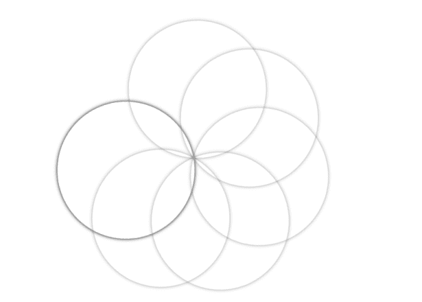

# 如何用 CSS 创建转盘效果？

> 原文:[https://www . geesforgeks . org/如何使用-css/](https://www.geeksforgeeks.org/how-to-create-rotating-disc-effect-using-css/) 创建旋转圆盘效果

旋转圆盘效果也称为重叠圆盘效果，是一种错觉效果，可以在网站上用于各种目的。它可以用于任何东西，从装载机贴纸到为用户创造一种错觉。它被称为重叠圆盘，因为有许多重叠的圆盘围绕着一个点旋转。

**方法:**方法是先创建所有的圆盘，然后使用[关键帧](https://www.geeksforgeeks.org/css-keyframes-rule/)和[第 n 个子](https://www.geeksforgeeks.org/css-nth-of-type-selector/)属性来旋转它们。

**HTML 代码:**在本节中，我们创建了一个内部有列表项的未排序列表(ul)。列表项目的数量等于光盘的数量。

```html
<!DOCTYPE html>
<html lang="en">
  <head>
    <meta charset="UTF-8" />
    <meta name="viewport" content=
        "width=device-width, initial-scale=1.0" />
    <title>Rotating Disc Effect</title>
 </head>
  <body>
    <ul>
      <li></li>
      <li></li>
      <li></li>
      <li></li>
      <li></li>
      <li></li>
      <li></li>
      <li></li>
    </ul>
  </body>
</html>
```

**CSS 代码:**对于 CSS，按照给定的步骤操作。

*   首先是使用 border-radius 属性创建光盘。将边框半径设置为 50%，以创建一个完美的圆。
*   现在，使用带有标识符的动画，该标识符稍后将用于关键帧。我们已经使用*动画*作为我们的标识符。
*   现在，使用关键帧来旋转每一帧的光盘。这里我们使用了 0 度为第一帧，359 度为第二帧。
*   现在，使用第 n 个子属性对每个光盘应用第 1 个延迟。它有助于旋转每一个光盘与一些延迟，这是负责幻觉的效果。

**提示:**你可以给每个圆盘应用不同的不透明度颜色，让它看起来更有吸引力。

```html
<style>
    ul {
        margin: 0;
        padding: 0;
        position: absolute;
        left: 40%;
        top: 20%;
    }

    ul li {
        list-style: none;
        width: 200px;
        height: 200px;
        position: absolute;
        top: 0;
        border-radius: 50%;
        box-shadow: 0 0 5px rgba(0, 0, 0, 0.5);
        animation: animate 7s linear infinite;
        transform-origin: bottom center;
    }

    @keyframes animate {
        0% {
            transform: rotate(0deg);
        }

        100% {
            transform: rotate(359deg);
        }
    }

    ul li:nth-child(1) {
        animation-delay: 0s;
    }

    ul li:nth-child(2) {
        animation-delay: 1s;
    }

    ul li:nth-child(3) {
        animation-delay: 2s;
    }

    ul li:nth-child(4) {
        animation-delay: 3s;
    }

    ul li:nth-child(5) {
        animation-delay: 4s;
    }

    ul li:nth-child(6) {
        animation-delay: 5s;
    }

    ul li:nth-child(7) {
        animation-delay: 6s;
    }

    ul li:nth-child(7) {
        animation-delay: 7s;
    }
</style>
```

**完整代码:**是以上两段代码的组合。

```html
<!DOCTYPE html>
<html lang="en">
  <head>
    <meta charset="UTF-8" />
    <meta name="viewport" content=
        "width=device-width, initial-scale=1.0" />
    <title>Rotating Disc Effect</title>
    <style>
      ul {
        margin: 0;
        padding: 0;
        position: absolute;
        left: 40%;
        top: 20%;
      }

      ul li {
        list-style: none;
        width: 200px;
        height: 200px;
        position: absolute;
        top: 0;
        border-radius: 50%;
        box-shadow: 0 0 5px rgba(0, 0, 0, 0.5);
        animation: animate 7s linear infinite;
        transform-origin: bottom center;
      }

      @keyframes animate {
        0% {
          transform: rotate(0deg);
        }
        100% {
          transform: rotate(359deg);
        }
      }

      ul li:nth-child(1) {
        animation-delay: 0s;
      }
      ul li:nth-child(2) {
        animation-delay: 1s;
      }
      ul li:nth-child(3) {
        animation-delay: 2s;
      }
      ul li:nth-child(4) {
        animation-delay: 3s;
      }
      ul li:nth-child(5) {
        animation-delay: 4s;
      }
      ul li:nth-child(6) {
        animation-delay: 5s;
      }
      ul li:nth-child(7) {
        animation-delay: 6s;
      }
      ul li:nth-child(7) {
        animation-delay: 7s;
      }
    </style>
  </head>
  <body>
    <ul>
      <li></li>
      <li></li>
      <li></li>
      <li></li>
      <li></li>
      <li></li>
      <li></li>
      <li></li>
    </ul>
  </body>
</html>
```

**输出:**
