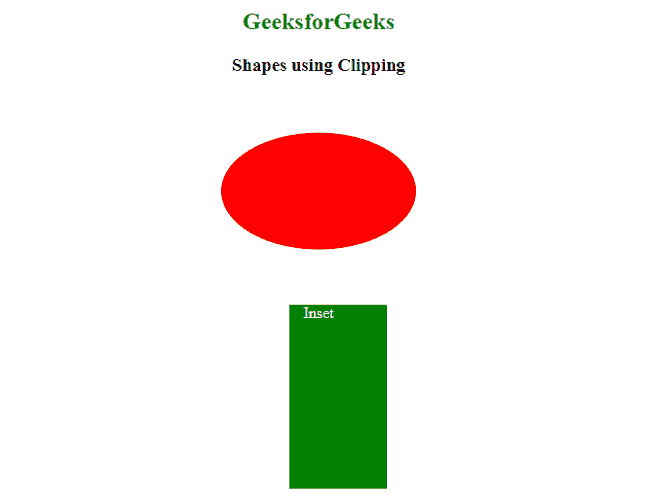

# 如何使用 CSS 裁剪创建形状？

> 原文:[https://www . geesforgeks . org/how-create-shape-using-CSS-clipping/](https://www.geeksforgeeks.org/how-to-create-shape-using-css-clipping/)

你可以使用 CSS 中的 [**剪辑路径**](https://www.geeksforgeeks.org/css-clip-path-property/) 属性轻松创建形状。实际上*剪辑路径*属性允许您将元素剪辑为基本形状。像圆、椭圆、多边形这样的基本形状可以使用裁剪路径的< **【基本形状】>** 属性值来实现，这将在本文中进一步讨论。

**属性值:**

*   **<基本形状> :** 它包括一些像圆形、矩形、椭圆形等形状来剪辑给定的图像。

**语法:**

```
clip-path: <basic-shape> 
```

**注意:** *剪辑路径*允许剪辑 SVG 元素、图像或任何 HTML 元素的可见部分。

**示例 1:** 以下示例创建圆形、多边形等形状。

*   **多边形:**

**语法:**

```
clip-path: polygon(pairs of X and Y coordinates)
```

*   **圆圈:**

**语法:**

```
clip-path: circle(radius);
```

## 超文本标记语言

```
<!DOCTYPE html>
<html lang="en">
<head>
    <meta charset="UTF-8">

    <style>
        h2{
            color:green;
        }
        /* Shape Circle */
        #circle {
            height: 200px;
            width: 200px;
            color: white;
            background-color: green;            
            clip-path: circle(50%);
        }

       /* Shape Polygon */
        #polygon {
            height: 200px;
            width: 200px;
            color: white;
            text-align: justify;
            background-color: red;
            clip-path: polygon(50% 0%, 100% 50%, 50% 100%, 0% 50%)
        }       

    </style>
</head>

<body>
    <center>

    <h2>GeeksforGeeks</h2>
    <h3>Shapes using Clipping</h3>

        <p id="circle" height="500" width="500" >Circle</p>

        <p id="polygon" >Polygon</p>

    </center>
</body>

</html>
```

**输出:**


圆形和多边形

**示例 2:** 以下示例创建椭圆和嵌入形状。

*   **椭圆:**

**语法:**

```
 clip-path: ellipse(radiusX radiusY at posX posY)
```

## 超文本标记语言

```
<!DOCTYPE html>
<html lang="en">

<head>
    <meta charset="UTF-8">

    <style>
        h1{
            color: green;
        }

        #ellipse {
            height: 200px;
            width: 200px;
            color: white;
            background-color: red;
            clip-path: ellipse(50% 65% at 70% 50%) 
        }
        #inset {
            height: 200px;
            width: 200px;
            color: white;
            margin-left:70px;
            background-color: green;
            clip-path: inset(20% 25% 20% 10%);
        }    
    </style>
</head>

<body>
    <center>

    <h1>GeeksforGeeks</h1>
    <h3>Shapes using Clipping</h3>

        <p id="ellipse">Ellipse</p>

        <p id="inset">Inset</p>

    </center>
</body>

</html>
```

**输出:**


椭圆和插图

**示例 3:** 以下示例创建圆形和七边形

**圆的语法:**

```
clip-path: circle(radius, shifted center by X, shifted center by Y)
```

## 超文本标记语言

```
<!DOCTYPE html>
<html lang="en">

<head>
    <meta charset="UTF-8">

    <style>
        h2{
            color: green;
        }
        /* Shape Circle */
        #circle {
            height: 200px;
            width: 200px;
            color: white;
            background-color: green;            
            clip-path: circle(70px at 50px 35px );
        }

       /* Shape Heptagon */
        #polygon {
            height: 200px;
            width: 200px;
            color: white;
            text-align: justify;
            background-color: red;
            clip-path: polygon(50% 0%, 
                     90% 20%, 100% 60%, 
                     75% 100%, 25% 100%, 
                     0% 60%, 10% 20%)
        }        

    </style>
</head>

<body>
    <center>

    <h2>Welcome to GeeksforGeeks</h2>
    <h3>Shapes using Clipping</h3>

        <p id="circle" height="500" width="500" >Circle</p>

        <p id="polygon" >Heptagon</p>

    </center>
</body>

</html>
```

**输出:**


**示例 4:** 以下示例创建椭圆和插图形状。

**椭圆语法:**

```
clip-path: ellipse(x, y) 
```

**插图语法:**

```
clipt-path: inset(top, right, bottom, left)
```

## 超文本标记语言

```
<!DOCTYPE html>
<html lang="en">

<head>
    <meta charset="UTF-8">

    <style>
        h2{
            color: green;
        }

        #ellipse
       {
            height: 200px;
            width: 200px;
            color: white;
            background-color: red;
            clip-path: ellipse(50% 30% ) /*ellipse(x, y) */
        }

        /* inset(top, right, bottom, left  ) */
        #inset 
        {
            height: 200px;
            width: 200px;
            color: white;
            background-color: green;
            clip-path: inset(1px 30px 10px 70px); /* inset(0 19% 4% 18%);*/
        }

    </style>
</head>

<body>
    <center>

    <h2>GeeksforGeeks</h2>
    <h3>Shapes using Clipping</h3>
        <p id="ellipse" >Ellipse</p>

        <p id="inset" >Inset</p>

    </center>
</body>

</html>
```

**输出:**



椭圆和插图