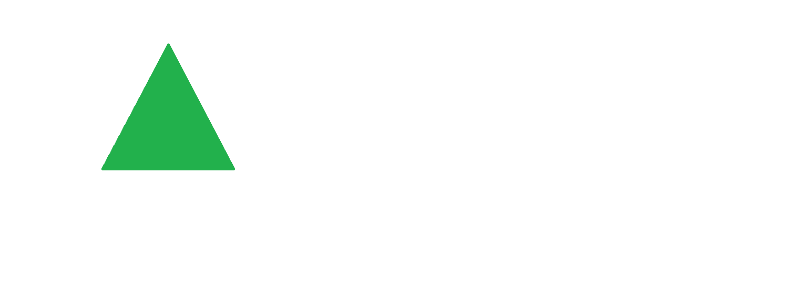
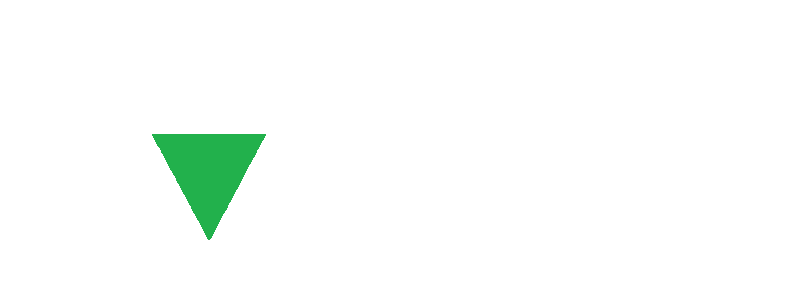
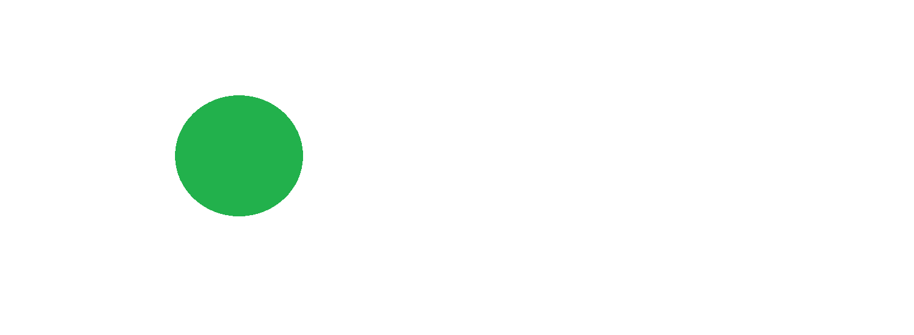
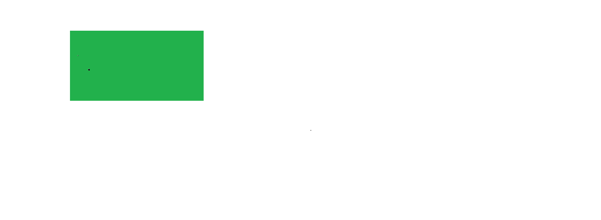
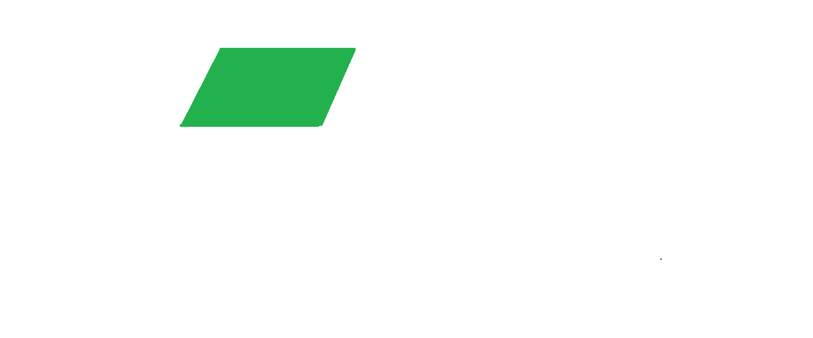
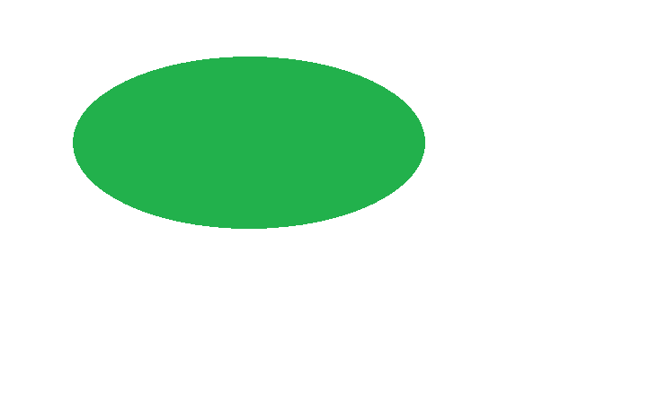

# 如何使用 CSS 创建形状？

> 原文:[https://www . geeksforgeeks . org/如何使用-css 创建形状/](https://www.geeksforgeeks.org/how-to-create-shapes-using-css/)

在本文中，我们将使用 CSS 设计一些不同类型的形状。CSS 能够制作所有类型的形状。

*   **创建一个正方形:**

## 超文本标记语言

```html
<!-- Write HTML code here -->
<!DOCTYPE html>
<html>

<head>
    <style>
        .square {
            height: 50px;
            width: 50px;
            background-color: green;
        }
    </style>
</head>

<body>
    <div class="square"></div>
</body>

</html>
```

**输出:**


*   **创建三角形**
    *   **向上:**

## 超文本标记语言

```html
<!-- Write HTML code here -->
<!DOCTYPE html>
<html>

<head>
    <style>
        .triangle {
            width: 0;
            height: 0;
            border-left: 25px solid transparent;
            border-right: 25px solid transparent;
            border-bottom: 50px solid green;
        }
    </style>
</head>

<body>
    <div class="triangle"></div>
</body>

</html>
```

**输出:**



*   **向下:**

## 超文本标记语言

```html
<!-- Write HTML code here -->
<!DOCTYPE html>
<html>

<head>
    <style>
        .triangle {
            width: 0;
            height: 0;
            border-left: 25px solid transparent;
            border-right: 25px solid transparent;
            border-top: 50px solid green;
        }
    </style>
</head>

<body>
    <div class="triangle"></div>
</body>

</html>
```

**输出:**



*   **创建圆:**

## 超文本标记语言

```html
<!-- Write HTML code here -->
<!DOCTYPE html>
<html>

<head>
    <style>
        .circle {
            height: 70px;
            width: 70px;
            background-color: green;
            border-radius: 50%;
        }
    </style>
</head>

<body>
    <div class="circle"></div>
</body>

</html>
```

**输出:**



*   **创建矩形:**

## 超文本标记语言

```html
<!-- Write HTML code here -->
<!DOCTYPE html>
<html>

<head>
    <style>
        .rectangle {
            height: 50px;
            width: 80px;
            background-color: green;
        }
    </style>
</head>

<body>
    <div class="rectangle"></div>
</body>

</html>
```

**输出:**



*   **创建平行四边形:**

## 超文本标记语言

```html
<!-- Write HTML code here -->
<!DOCTYPE html>
<html>

<head>
    <style>
        .parallelogram {
            width: 120px;
            height: 60px;
            transform: skew(24deg);
            background: green;
        }
    </style>
</head>

<body>
    <div class="parallelogram"></div>
</body>

</html>
```

*   **输出:**



*   **创建椭圆形:**

## 超文本标记语言

```html
<!-- Write HTML code here -->
<!DOCTYPE html>
<html>

<head>
    <style>
        .oval {
            height: 200px;
            width: 400px;
          border-radius: 50%;
            background-color: green;
        }
    </style>
</head>

<body>
    <div class="oval"></div>
</body>

</html>
```

*   **输出:**

