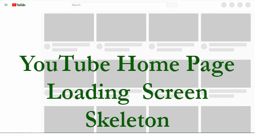

# 如何使用 CSS 创建骨骼屏幕加载效果？

> 原文:[https://www . geesforgeks . org/how-create-skeleton-screen-loading-effect-use-CSS/](https://www.geeksforgeeks.org/how-to-create-skeleton-screen-loading-effect-using-css/)



框架屏幕用于指示内容正在加载。它们也被称为闪屏。这是现代设计潮流的一部分。在某些情况下，骨架筛比加载旋转器更好。它被许多大公司使用，如脸书、谷歌等。

**HTML 代码:**在本节中，我们将创建加载页面屏幕骨架的基本结构。为了创建一个加载页面框架，我们需要使用< div >元素来显示内容。我们将为卡片内的每个元素添加一个`loading`类，当加载内容时，我们将移除该类。

```css
<!DOCTYPE html>
<html>

<head>
    <title>
        How to Create Skeleton Screen
        Loading Effect using CSS?
    </title>
</head>

<body>
    <div class="card">
        <div class="card__image loading"></div>
        <div class="card__title loading"></div>
        <div class="card__description loading"></div>
    </div>
</body>

</html>
```

**CSS 代码:**在本节中，我们将使用一些 CSS 属性来创建加载页面屏幕骨架。

```css
<style>

    /* Card styles */
    .card{
        background-color: #fff;
        height: auto;
        width: auto;
        overflow: hidden;
        margin: 12px;
        border-radius: 5px;
        box-shadow: 9px 17px 45px -29px
                    rgba(0, 0, 0, 0.44);
    }

    /* Card image loading */
    .card__image img {
        width: 100%;
        height: 100%;
    }

    .card__image.loading {
        height: 300px;
        width: 400px;
    }

    /* Card title */
    .card__title {
        padding: 8px;
        font-size: 22px;
        font-weight: 700;
    }

    .card__title.loading {
        height: 1rem;
        width: 50%;
        margin: 1rem;
        border-radius: 3px;
    }

    /* Card description */
    .card__description {
        padding: 8px;
        font-size: 16px;
    }

    .card__description.loading {
        height: 3rem;
        margin: 1rem;
        border-radius: 3px;
    }

    /* The loading Class */
    .loading {
        position: relative;
        background-color: #e2e2e2;
    }

    /* The moving element */
    .loading::after {
        display: block;
        content: "";
        position: absolute;
        width: 100%;
        height: 100%;
        transform: translateX(-100%);
        background: -webkit-gradient(linear, left top,
                    right top, from(transparent), 
                    color-stop(rgba(255, 255, 255, 0.2)),
                    to(transparent));

        background: linear-gradient(90deg, transparent,
                rgba(255, 255, 255, 0.2), transparent);

        /* Adding animation */
        animation: loading 0.8s infinite;
    }

    /* Loading Animation */
    @keyframes loading {
        100% {
            transform: translateX(100%);
        }
    }
</style>
```

**注意:**`loading` 类有一个伪元素，为了模仿动画从左向右移动。

**JavaScript 代码:**现在，当加载内容时，我们可以从每个元素中移除`loading`类，并将内容添加到适当的位置。

```css
<script>
    const title = document.querySelector(".card__title");
    const description = document.querySelector(".card__description");
    const image = document.querySelector(".card__image");

    // Remove the 'loading' class
    title.classList.remove("loading");
    description.classList.remove("loading");
    image.classList.remove("loading");

    // Add the content
    title.textContent = 'Title';
    description.textContent = 'This is the description.';
    image.innerHTML = `
```

**完整代码:**在本节中，我们将结合以上两个部分(HTML 和 CSS 代码)来创建骨骼屏幕加载效果。如果添加了 JavaScript 代码，那么数据将替换骨架。

**示例:**

```css
<!DOCTYPE html>
<html>

<head>
    <title>
        How to Create Skeleton Screen
        Loading Effect using CSS?
    </title>

    <style>

        /* Card styles */
        .card{
            background-color: #fff;
            height: auto;
            width: auto;
            overflow: hidden;
            margin: 12px;
            border-radius: 5px;
            box-shadow: 9px 17px 45px -29px
                        rgba(0, 0, 0, 0.44);
        }

        /* Card image loading */
        .card__image img {
            width: 100%;
            height: 100%;
        }

        .card__image.loading {
            height: 300px;
            width: 400px;
        }

        /* Card title */
        .card__title {
            padding: 8px;
            font-size: 22px;
            font-weight: 700;
        }

        .card__title.loading {
            height: 1rem;
            width: 50%;
            margin: 1rem;
            border-radius: 3px;
        }

        /* Card description */
        .card__description {
            padding: 8px;
            font-size: 16px;
        }

        .card__description.loading {
            height: 3rem;
            margin: 1rem;
            border-radius: 3px;
        }

        /* The loading Class */
        .loading {
            position: relative;
            background-color: #e2e2e2;
        }

        /* The moving element */
        .loading::after {
            display: block;
            content: "";
            position: absolute;
            width: 100%;
            height: 100%;
            transform: translateX(-100%);
            background: -webkit-gradient(linear, left top,
                        right top, from(transparent), 
                        color-stop(rgba(255, 255, 255, 0.2)),
                        to(transparent));

            background: linear-gradient(90deg, transparent,
                    rgba(255, 255, 255, 0.2), transparent);

            /* Adding animation */
            animation: loading 0.8s infinite;
        }

        /* Loading Animation */
        @keyframes loading {
            100% {
                transform: translateX(100%);
            }
        }
    </style>
</head>

<body>
    <div class="card">
        <div class="card__image loading"></div>
        <div class="card__title loading"></div>
        <div class="card__description loading"></div>
    </div>
</body>

</html>
```

**输出:**
