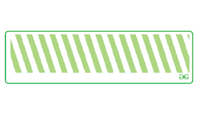
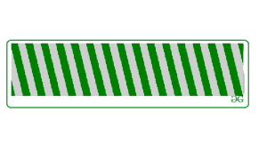
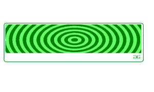

# 如何使用 CSS 创建斜线？

> 原文:[https://www . geeksforgeeks . org/如何使用-css/](https://www.geeksforgeeks.org/how-to-create-sloping-lines-using-css/) 创建斜线

先决条件- [CSS](https://www.geeksforgeeks.org/css-tutorials/)

使用 CSS 中的[背景图像属性](https://www.geeksforgeeks.org/css-background-image-property/)很容易实现这些斜线，

*   **正常彩色对角线条纹:**这里，对角线条纹是使用 CSS 中的[重复线性渐变()](https://www.geeksforgeeks.org/css-repeating-linear-gradient-function/)构造的。

    示例:

    ```html
    <!DOCTYPE html>
    <html >
    <head>
        <meta charset="utf-8">
        <style> 
    .module {
      background: white;
      border: 1px solid #ccc;
      margin: 3%;
      width: 40%;
      > h2 {
        padding: 1rem;
        margin: 0 0 0.5rem 0;
      }

    }

    .stripe-1 {
      color: white;
      background: repeating-linear-gradient(
          /*Angle of sloping line*/
        45deg,
          /*First Color of the Stripe*/
        #fff,
        #fff 10px,
          /*Second Color of the Stripe*/
        #aed581  10px,
        #aed581 20px
      );
    }
    </style>

    </head>

    <body>
       <div class="module">
      <h2 class="stripe-1">GFG</h2>
        </div>
    </body>
    </html>
    ```

    **输出:**
    

*   **渐变对角线条纹:**这使得一半的条纹完全透明使用 r [重影-线性-渐变()](https://www.geeksforgeeks.org/css-repeating-linear-gradient-function/)，看起来条纹好像有渐变。

    示例:

    ```html
    <!DOCTYPE html>
    <html >
    <head>
        <meta charset="utf-8">
        <style> 
    .module {
      background: white;
      border: 1px solid #ccc;
      margin: 3%;
      width: 40%;
      > h2 {
        padding: 1rem;
        margin: 0 0 0.5rem 0;
      }

    }

    .stripe-1 {
      color: white;
      background:  repeating-linear-gradient(
          /*Angle of the slope line*/
          45deg,
          /*To make The stripe transparent at the end*/
          transparent,
          transparent 10px,
          #ccc 10px,
          #ccc 20px
        ),
        linear-gradient(
          to bottom,
            /*Color of the Stripe*/
          green,
          green
        );
    }
    </style>

    </head>

    <body>
       <div class="module">
      <h2 class="stripe-1">GFG</h2>
        </div>
    </body>
    </html>
    ```

    **输出:**
    

*   **径向条纹:**这些条纹是使用径向梯度实现的，可以在[重复线性梯度下使用()。](https://www.geeksforgeeks.org/css-repeating-linear-gradient-function/)

    示例:

    ```html
    <!DOCTYPE html>
    <html >
    <head>
        <meta charset="utf-8">
        <style> 
    .module {
      background: white;
      border: 1px solid #ccc;
      margin: 3%;
      width: 40%;
      > h2 {
        padding: 1rem;
        margin: 0 0 0.5rem 0;
      }

    }

    .stripe-1 {
      color: white;
      background:  repeating-radial-gradient(
          /*Shape of the repeating lines*/
      circle,
          /*First Color of the stripe*/
      green,
      green 10px,
          /*Second Color of the stripe*/
      #aed581 10px, 
     #aed581  20px
    );

    }
    </style>

    </head>

    <body>
       <div class="module">
      <h2 class="stripe-1">GFG</h2>
        </div>
    </body>
    </html>
    ```

    **输出:**
    