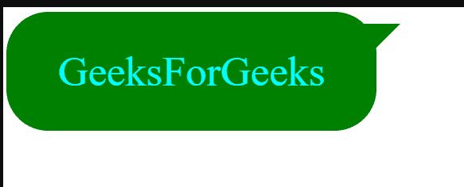

# 如何使用 CSS 创建没有图像的语音气泡？

> 原文:[https://www . geesforgeks . org/如何使用-css/](https://www.geeksforgeeks.org/how-to-create-speech-bubbles-without-images-using-css/) 创建不带图像的语音气泡

我们可以使用没有图像、没有 JavaScript、没有额外框架或任何东西的 HTML 和 CSS 来创建令人敬畏的语音气泡。

使用单个 HTML *div，*元素，我们正在创建一个语音气泡，您可以选择任何其他元素。我们将制作一个简单的盒子，里面有一些我们可以根据自己的选择进行调整的样式。之后，我们将对我们的盒子做一个三角形的提示，使它看起来像一个语音气泡。重要的是定位*相对*或者*绝对*。

**示例:**以下代码有助于使用 HTML 和 CSS3 创建语音气泡。

## 超文本标记语言

```css
<!DOCTYPE html>
<html>

<head>
    <style>
        /* Creating a box with a text
           and some stylings  */
        .speech {
            width: 250px;
            background: green;
            padding: 30px;
            text-align: center;
            font-size: 35px;
            border-radius: 35px;
            color: cyan;
            position: relative;
        }

        /* Creates triangular tip on the
           end, for our speech bubble 
           with some styling */
        .speech:before {
            content: "";
            position: absolute;
            border-left: 20px solid green;
            border-right: 20px solid transparent;
            border-top: 20px solid green;
            border-bottom: 20px solid transparent;
            right: -20px;
            top: 10px;
        }
    </style>
</head>

<body>
    <div class="speech bubble">GeeksForGeeks</div>
</body>

</html>
```

**输出:**

