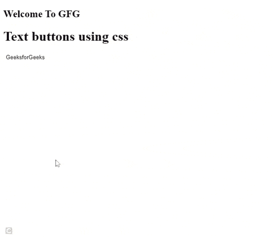

# 如何使用 CSS 创建文本按钮？

> 原文:[https://www . geesforgeks . org/how-create-text-buttons-using-CSS/](https://www.geeksforgeeks.org/how-to-create-text-buttons-using-css/)

在本文中，我们将看到如何使用 CSS 创建文本按钮。

**文本**按钮是一个看起来像文本的按钮，但如果我们按下它，它就像一个按钮。文本按钮与锚点标签不同，即使它们看起来相似。为了首先创建文本按钮，我们使用按钮标签在 HTML 中创建简单的按钮。创建按钮后，我们应用 CSS 并更改其属性，使其看起来像一个文本按钮。为了使它看起来像一个文本按钮，我们删除了它的默认边框和背景。为了识别它是一个按钮，我们给了悬停颜色，因此，当我们将光标移动到它上面时，它会将其颜色从透明变为绿色。

**语法:**

```css
#textButton{
       background:none; 
       border:none;     
}
#textButton:hover{
       background-color: green;
}
```

**示例:**以下演示了上述方法。我们创建了一个 HTML 文件，并使用 id 为“textButton”的按钮标签创建了一个名为“GeeksforGeeks”的按钮。之后，我们创建了一个样式标签，其中我们使用按钮的 id 选择了该按钮，并通过将它们设置为无来移除其背景和边框属性。我们添加了悬停背景色，以便用户可以识别我们的按钮。

## 超文本标记语言

```css
<!DOCTYPE html>
<html>
<body>
<h2>Welcome To GFG</h2>
 <h1>Text buttons using css</h1>
  <!-- creating buttons -->
    <button id="textButton">
      GeeksforGeeks
    </button>

  <!-- Applying styling to buttons -->
  <style>
        #textButton{
            background:none; 
            border:none;     
        }
        #textButton:hover{
            background-color: green;
        }
    </style>
</body>
</html>
```

**输出:**



使用 CSS 的文本按钮