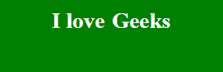

# 如何使用 CSS 创建文本变化动画效果？

> 原文:[https://www . geesforgeks . org/how-create-text-changing-animation-effect-use-CSS/](https://www.geeksforgeeks.org/how-to-create-text-changing-animation-effect-using-css/)

我们今天访问的几乎所有网站都使用某种文本动画来吸引用户。一般来说，所有类型的文本动画都是使用普通或普通的 JavaScript 或一些第三方 JavaScript 库制作的。但是有一些动画可以只用 CSS 制作。其中之一就是改变文字动画这个词。在这种类型的动画中，选择一个单词在一定时间间隔后进行更改。这是一个稍老的动画，是十年前使用的最早的文本动画之一。

**方法:**方法是使用[关键帧](https://www.geeksforgeeks.org/css-keyframes-rule/)在某一帧换词。可以使用 content 属性设置单词。

**HTML 代码:**在本节中，我们将标题包装在< h1 >标签中。我们还有一个跨度，稍后将使用 CSS 填充。

```css
<!DOCTYPE html>
<html lang="en">

<head>
    <meta charset="UTF-8" />
    <meta name="viewport" content=
        "width=device-width, initial-scale=1.0" />
    <title>Text Animation</title>
</head>

<body>
    <h1>I love <span> </span></h1>
</body>

</html>
```

**CSS 代码:**

*   **第一步:**做一些基本的样式，比如背景色、文字色、边距、填充等。
*   **第二步:**现在，使用 before select/or 将 span 的内容设置为一个初始单词。
*   **步骤 3:** 使用动画属性设置动画的总时间。
*   **步骤 4:** 现在，使用关键帧来更改在选择器之前为每一帧设置的内容属性。

**提示:**可以根据需要设置总时间。但是一般来说，建议使用一个时间，这个时间是你想要改变的单词总数的倍数。就像在我们的例子中，我们有三个词，我们用 3s 作为总时间。你可以用 6，9，12…等等。将时间设置为单词总数的倍数将确保每个单词显示的时间相等。

```css
<style>
    body {
        background: green;
    }

    h1 {
        display: flex;
        justify-content: center;
        color: white;
    }

    span::before {
        content: "Geeks";
        animation: animate infinite 3s;
        padding-left: 10px;
    }

    @keyframes animate {

        0% {
            content: "Geeks";
        }

        50% {
            content: "for";
        }

        75% {
            content: "Geeks";
        }
    }
</style>
```

**完整代码:**是以上两段代码的组合。

```css
<!DOCTYPE html>
<html lang="en">

<head>
    <meta charset="UTF-8" />
    <meta name="viewport" content=
        "width=device-width, initial-scale=1.0" />
    <title>Text Animation</title>

    <style>
        body {
            background: green;
        }

        h1 {
            display: flex;
            justify-content: center;
            color: white;
        }

        span::before {
            content: "Geeks";
            animation: animate infinite 3s;
            padding-left: 10px;
        }

        @keyframes animate {

            0% {
                content: "Geeks";
            }

            50% {
                content: "for";
            }

            75% {
                content: "Geeks";
            }
        }
    </style>
</head>

<body>
    <h1>I love <span> </span></h1>
</body>

</html>
```

**输出:**
