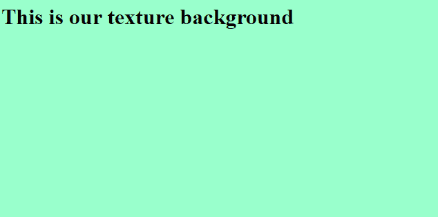

# 如何使用 CSS 创建纹理背景？

> 原文:[https://www . geesforgeks . org/how-create-texture-background-use-CSS/](https://www.geeksforgeeks.org/how-to-create-texture-background-using-css/)

**简介:**我们可以使用 CSS 属性，通过使用图像编辑器剪切出一部分背景，来对网页的背景进行纹理处理。应用 **CSS** [背景-重复属性](https://www.geeksforgeeks.org/css-background-repeat-property/)使小图像填充使用它的区域。CSS 提供了许多背景的样式属性，包括给背景、背景图像等着色。背景属性为`background-color, background-image, background-position, background-attachment.`

**纹理化背景的方法:**使用 CSS 纹理化背景有一些步骤，有例子和说明。

*   使用 **html 标签创建一个 html 文件。**

    ```css
    <html>

    <head>
        <title>
            Texture Background
            Using CSS 
        </title>
    </head>
    <body></body>

    </html>
    ```

*   选择我们想要在背景中设置的纹理颜色。将纹理颜色保存为图像格式，如()。巴布亚新几内亚。jpg 等)
*   假设我们想使用内部表单 CSS 设置这个网页的背景。所以在**头节**写下下面的代码。

    ```css
    <style>
        body {
            background-image: url("BG.jpg");
            background-repeat: repeat/no-repeat;
            background-size: 1600px 840px:
        }
    </style>
    ```

**示例:**

```css
<!DOCTYPE>
<html>

<head>
    <title>
        Texture Background using CSS
    </title>

    <style>
        body {
            background-image: url(
"https://contribute.geeksforgeeks.org/wp-content/uploads/backgroundimage-1.png");
            background-repeat: no-repeapt;
        }
    </style>
</head>

<body>
    <h1>
        This is our texture
        background
    </h1>
</body>

</html>
```

**说明:**在本代码中，我们通过**background-image:URL(“background image-1 . png”)将图像放置在背景中；**以. jpg 的形式，可以在。巴布亚新几内亚也是。这里，我们不是在背景中重复图像，所以，图像在背景中只显示一次，**背景-重复:不-重复；**此语法表示图像不重复。这些命令都是用 CSS 用 **<样式>** 标签写的。
**输出:**
