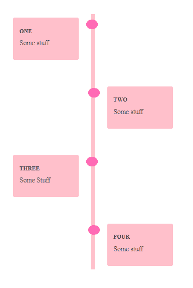

# 如何使用 CSS 创建时间轴？

> 原文:[https://www . geeksforgeeks . org/如何创建时间线-使用-css/](https://www.geeksforgeeks.org/how-to-create-timeline-using-css/)

我们可以使用一些基本的 HTML 和 CSS 轻松地创建一个时间线。HTML 代码用于创建时间轴的基本结构，CSS 代码用于设置样式。

**HTML 代码:**在这一节中，我们将创建一个时间线的结构。我们的结构将包括四个事件。

**步骤:**

*   用类主容器创建一个 div 元素。
*   在我们的主容器中，用类文本包装器再创建四个 div。
*   在每个包含类文本包装的 div 中包含另一个包含类内容的 div，并在其中包含一个 h3 和 p 标签。

**示例:** HTML 代码

```css
<!DOCTYPE html>
<html>
<body>
 <!-- container which will contain our timeline -->
    <div class="main-container">
        <!-- event 1st of timeline -->
        <div class="text-wrapper left">
            <!-- all text content of timeline -->
            <div class="content">
                <h3>one</h3>
                <p>Some stuff</p>
            </div>
        </div>
        <!-- event 1st of timeline -->
        <div class="text-wrapper right">
            <!-- all text content of timeline -->
            <div class="content">
                <h3>two</h3>
                <p>Some stuff</p>
            </div>
        </div>
        <!-- event 1st of timeline -->
        <div class="text-wrapper left">
            <!-- all text content of timeline -->
            <div class="content">
                <h3>three</h3>
                <p>Some Stuff</p>
            </div>
        </div>
        <!-- event 1st of timeline -->
        <div class="text-wrapper right">
            <!-- all text content of timeline -->
            <div class="content">
                <h3>four</h3>
                <p>Some stuff</p>
            </div>
        </div>
    </div>
</body>
</html>
```

**CSS 代码:**我们将使用 CSS 给我们的时间线一些结构，并设置事件的位置。

```css
<style>
  .main-container{
    position: relative;
    width: 500px;
}
/*creating line for timeline*/
.main-container::after{
    content: '';
    position: absolute;
    width: 10px;
    background-color: #FFC0CB;
    top:0;
    bottom: 0;
    left: 50%;
    margin-left: -3px;
}
/*Adjusting box of all content*/
.text-wrapper{
    padding: 10px 40px;
    position: relative;
    width:51%;
    box-sizing: border-box;
    margin: 50px 0;
}
.text-wrapper::after{
    content: '';
    position: absolute;
    width: 30px;
    height: 25px;
    right: -10px;
    background-color:#FF69B4;
    top:15px;
    border-radius: 50%;
    z-index: 1;
}
/*for left events*/
.left{
    left: 0;
}
/*for right events*/
.right{
    left:50%;
}
.right::after{
    left:-10px;
}
/*content box colour padding and radius for circular corner*/
.content{
    padding: 15px 15px 15px 17px;
    background-color: #FFC0CB;
    border-radius: 4px;
}
/*setting text property of event heading*/
.content h3{
    text-transform: uppercase;
    font-size: 14px;
    color: #212121;
    letter-spacing:1px;
}
/*setting text property of event content*/
.content p{
    color: #616161;
    font-weight: 300;
    font-size: 18px;
    margin-top: 2px;
}
  </style>
```

**完整代码:**

```css
<!DOCTYPE html>
<html>
<head>
  <style>
  .main-container{
    position: relative;
    width: 500px;
}
/*creating line for timeline*/
.main-container::after{
    content: '';
    position: absolute;
    width: 10px;
    background-color: #FFC0CB;
    top:0;
    bottom: 0;
    left: 50%;
    margin-left: -3px;
}
/*Adjusting box of all content*/
.text-wrapper{
    padding: 10px 40px;
    position: relative;
    width:51%;
    box-sizing: border-box;
    margin: 50px 0;
}
.text-wrapper::after{
    content: '';
    position: absolute;
    width: 30px;
    height: 25px;
    right: -10px;
    background-color:#FF69B4;
    top:15px;
    border-radius: 50%;
    z-index: 1;
}
/*for left events*/
.left{
    left: 0;
}
/*for right events*/
.right{
    left:50%;
}
.right::after{
    left:-10px;
}
/*content box colour padding 
and radius for circular corner*/
.content{
    padding: 15px 15px 15px 17px;
    background-color: #FFC0CB;
    border-radius: 4px;
}
/*setting text property of event heading*/
.content h3{
    text-transform: uppercase;
    font-size: 14px;
    color: #212121;
    letter-spacing:1px;
}
/*setting text property of event content*/
.content p{
    color: #616161;
    font-weight: 300;
    font-size: 18px;
    margin-top: 2px;
}
  </style>
</head>
<body>
 <!-- container which will contain our timeline -->
    <div class="main-container">
        <!-- event 1st of timeline -->
        <div class="text-wrapper left">
            <!-- all text content of timeline -->
            <div class="content">
                <h3>one</h3>
                <p>Some stuff</p>
            </div>
        </div>
        <!-- event 1st of timeline -->
        <div class="text-wrapper right">
            <!-- all text content of timeline -->
            <div class="content">
                <h3>two</h3>
                <p>Some stuff</p>
            </div>
        </div>
        <!-- event 1st of timeline -->
        <div class="text-wrapper left">
            <!-- all text content of timeline -->
            <div class="content">
                <h3>three</h3>
                <p>Some Stuff</p>
            </div>
        </div>
        <!-- event 1st of timeline -->
        <div class="text-wrapper right">
            <!-- all text content of timeline -->
            <div class="content">
                <h3>four</h3>
                <p>Some stuff</p>
            </div>
        </div>
    </div>
</body>
</html>
```

**输出:**

