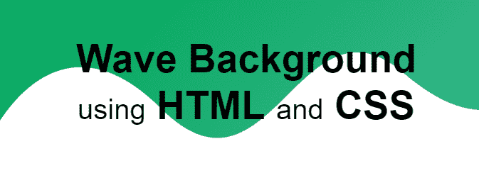
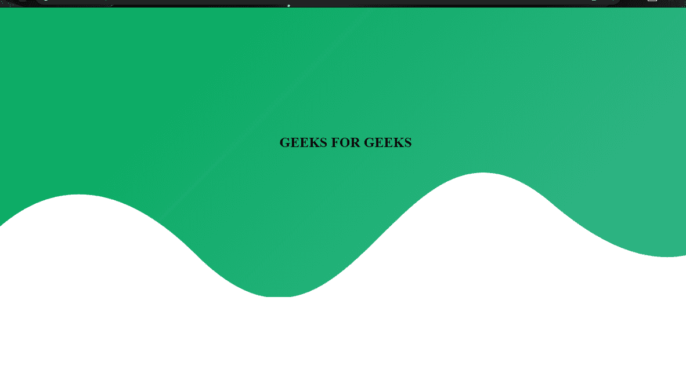

# 如何使用 CSS 创建波浪背景？

> 原文:[https://www . geesforgeks . org/如何使用 css 创建波背景/](https://www.geeksforgeeks.org/how-to-create-wave-background-using-css/)



在 选择器之前使用 [**可以轻松生成波浪背景。我们将使用波浪图像。您可以自行创建或从**](https://www.geeksforgeeks.org/css-before-selector/)**[下载的 png 文件格式。
**HTML 代码:**在本节中，我们将设计代码的基本结构。](https://media.geeksforgeeks.org/wp-content/uploads/20200326181026/wave3.png)** 

## 超文本标记语言

```html
<!DOCTYPE html>
<html lang="en">

<head>
    <meta charset="UTF-8" />
    <meta name="viewport" content=
        "width=device-width, initial-scale=1.0" />

    <title>
        How to Create Wave Background using CSS ?
    </title>
</head>

<body>
    <section class="pattern">
        <div class="geeks">
            <h1>GEEKS FOR GEEKS</h1>
        </div>
    </section>
</body>

</html>
```

**CSS 代码:**在本节中，我们将使用一些 CSS 属性来设计波浪背景。首先我们将添加一个基本的背景到这个部分，然后使用之前的 [**选择器在我们的背景上设置 wave png 文件。**](https://www.geeksforgeeks.org/css-before-selector/) 

## 半铸钢ˌ钢性铸铁(Cast Semi-Steel)

```html
<style>
    body {
        padding: 0%;
        margin: 0%;
    }
    .geeks {
        padding: 200px;
        text-align: center;
    }

    section {
        width: 100%;
        min-height: 500px;
    }

    .pattern {
        position: relative;
        background-color: #3bb78f;
        background-image: linear-gradient(315deg,
                        #3bb78f 0%, #0bab64 74%);
    }

    .pattern:before {
        content: "";
        position: absolute;
        bottom: 0;
        left: 0;
        width: 100%;
        height: 215px;
        background: url(wave.png);
        background-size: cover;
        background-repeat: no-repeat;
    }
</style>
```

**完整代码:**是以上两个代码段的组合。

## 超文本标记语言

```html
<!DOCTYPE html>
<html lang="en">

<head>
    <meta charset="UTF-8" />
    <meta name="viewport" content=
        "width=device-width, initial-scale=1.0" />

    <title>
        How to Create Wave Background using CSS ?
    </title>

    <style>
        body {
            padding: 0%;
            margin: 0%;
        }

        .geeks {
            padding: 200px;
            text-align: center;
        }

        section {
            width: 100%;
            min-height: 300px;
        }

        .pattern {
            position: relative;
            background-color: #3bb78f;
            background-image: linear-gradient(315deg,
                    #3bb78f 0%, #0bab64 74%);
        }

        .pattern:before {
            content: "";
            position: absolute;
            bottom: 0;
            left: 0;
            width: 100%;
            height: 250px;
            background: url(
https://media.geeksforgeeks.org/wp-content/uploads/20200326181026/wave3.png);
            background-size: cover;
            background-repeat: no-repeat;
        }
    </style>
</head>

<body>
    <section class="pattern">
        <div class="geeks">
            <h1>GEEKS FOR GEEKS</h1>
        </div>
    </section>
</body>

</html>
```

**输出:**

