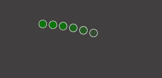

# 如何使用 CSS 创建波球效果？

> 原文:[https://www . geesforgeks . org/如何使用-css/](https://www.geeksforgeeks.org/how-to-create-wave-ball-effect-using-css/) 创建波球效果

波浪球效果是动画效果领域的一个新入口，用于现代网络应用程序的设计。在这个效果中，我们有一些像波浪一样动画的球。现在你可以给它添加不同的元素，使它像不同颜色的球和动画一样独特-延迟或通过改变动画的轴。

**方法:**方法是首先创建一些小尺寸的球，然后使用*关键帧*来制作它们的动画，并在每个帧分割上更改球的颜色。然后我们会给每个球增加一些动画延迟。虽然，动画延迟部分是可选的。

**HTML 代码:**在这一节中，我们已经创建了许多将用于制作球的跨度标签。所有这些都被包装在一个 div 标签中。

```css
<!DOCTYPE html>
<html>
<head>
<title>Wave Ball Effect</title>
</head>
<body>
     <div class="loader">
      <span></span>
      <span></span>
      <span></span>
      <span></span>
      <span></span>
      <span></span>
    </div>
</body>
</html>
```

**CSS 代码:**对于 CSS，请按照下面给出的步骤操作。

*   **第一步:**首先，给车身标签应用深色背景。
*   **步骤 2:** 现在将所有跨度标签对齐页面中心。
*   **第三步:**现在使用带有标识符名称*的动画属性制作动画。*
*   **第 4 步:**现在使用*关键帧*到为每个帧分割应用边框和颜色。在 Y 轴上使用变换。
*   **第五步:**现在使用第 n 个子属性给每个 span 标签一些动画延迟。

```css
body {
        background: rgb(65, 63, 63);
      }

      .loader {
        height: 40px;
        position: absolute;
        top: 50%;
        left: 50%;
      }
      .loader span {
        height: 15px;
        width: 15px;
        display: inline-block;
        border-radius: 50%;
        transition: all 0.5s;
        animation: animate 2s infinite;
      }
      @keyframes animate {
        0% {
          border: 1px solid #fff;
          background: transparent;

          transform: translateY(0);
        }
        50% {
          border: 1px solid #fff;
          background: green;

          transform: translateY(-25px);
        }
        100% {
          border: 1px solid #fff;
          background: yellow;

          transform: translateY(0);
        }
      }
      .loader span:nth-child(1) {
        animation-delay: 0;
      }

      .loader span:nth-child(2) {
        animation-delay: 0.1s;
      }

      .loader span:nth-child(3) {
        animation-delay: 0.2s;
      }

      .loader span:nth-child(4) {
        animation-delay: 0.3s;
      }

      .loader span:nth-child(5) {
        animation-delay: 0.4s;
      }

      .loader span:nth-child(6) {
        animation-delay: 0.5s;
      }
```

**提示:**确保球的大小保持较小，并且可以将动画的轴更改为 X 轴以获得不同的效果。

**完整代码:**是以上两段代码的组合。

```css
<!DOCTYPE html>
<html>
<head>
<title>Wave Ball Effect</title>
  <style>
        body {
        background: rgb(65, 63, 63);
      }

      .loader {
        height: 40px;
        position: absolute;
        top: 50%;
        left: 50%;
      }
      .loader span {
        height: 15px;
        width: 15px;
        display: inline-block;
        border-radius: 50%;
        transition: all 0.5s;
        animation: animate 2s infinite;
      }
      @keyframes animate {
        0% {
          border: 1px solid #fff;
          background: transparent;

          transform: translateY(0);
        }
        50% {
          border: 1px solid #fff;
          background: green;

          transform: translateY(-25px);
        }
        100% {
          border: 1px solid #fff;
          background: yellow;

          transform: translateY(0);
        }
      }
      .loader span:nth-child(1) {
        animation-delay: 0;
      }

      .loader span:nth-child(2) {
        animation-delay: 0.1s;
      }

      .loader span:nth-child(3) {
        animation-delay: 0.2s;
      }

      .loader span:nth-child(4) {
        animation-delay: 0.3s;
      }

      .loader span:nth-child(5) {
        animation-delay: 0.4s;
      }

      .loader span:nth-child(6) {
        animation-delay: 0.5s;
      }
  </style>
</head>
<body>

    <div class="loader">
      <span></span>
      <span></span>
      <span></span>
      <span></span>
      <span></span>
      <span></span>
    </div>
</body>
</html>
```

**输出:**

