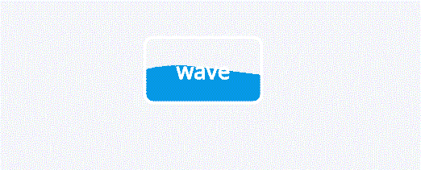

# 如何用 CSS 和 HTML 在按钮上创建波浪？

> 原文:[https://www . geeksforgeeks . org/如何用 css 和 html 创建按钮波/](https://www.geeksforgeeks.org/how-to-create-waves-on-button-with-css-and-html/)

按钮上的波浪效果是一种在悬停时按钮形状变成波浪的效果。虽然有其他方法可以创建波浪效果，但一个简单的方法是使用关键帧属性。

**逼近:**为了给按钮设置动画，我们使用关键帧来逐渐设置不同阶段的过渡。
**HTML 代码:**
HTML 代码是一个简单的结构，它包含一个包装器，其中跨度标签被包装在锚标签中。

```css
<html>
  <head></head>
  <body>
    <div class="wrapper">
      <a href="#" class="wave-btn"><span>wave</span></a>
    </div>
  </body>
</html>
```

**CSS 代码:**

*   添加背景色等基本样式，定位按钮并设置按钮的宽度和高度。*   使用标识符为 wave 的动画属性。*   Now use keyframes to animate each frame according to their angle by using the transform property.

    ```css
    <style>

    @import url("https://fonts.googleapis.com/css?family=Noto+Sans");
    * {
      position: relative;
    }

    html,
    body {
      margin: 0;
      padding: 0;
      height: 100%;
    }

    .wrapper {
      height: 100%;
      background-color: #f5f6fa;
    }

    .wave-btn {
      color: #fff;
      text-decoration: none;
      border: 3px solid #fff;
      padding: 5px 30px;
      font-size: 22px;
      font-weight: 600;
      font-family: "Noto Sans";
      line-height: 52px;
      border-radius: 10px;
      position: absolute;
      top: 50%;
      left: 50%;
      transform: translate(-50%, -50%);
      overflow: hidden;
      transition: all 1s;
    }

    .wave-btn:before {
      content: "";
      position: absolute;
      width: 320px;
      height: 320px;
      border-radius: 130px;
      background-color: #0097e6;
      top: 30px;
      left: 50%;
      transform: translate(-50%);
      animation: wave 5s infinite linear;
      transition: all 1s;
    }

    .wave-btn:hover:before {
      top: 15px;
    }

    @keyframes wave {
      0% {
                transform: translate(-50%) rotate(-180deg);

      }

      100% {
                transform: translate(-50%) rotate(360deg);
      }
    }

    </style>
    ```

    **完整代码:**

    ```css
    <html>
      <head>
        <style>
       @import url("https://fonts.googleapis.com/css?family=Noto+Sans");
    * {
      position: relative;
    }

    html,
    body {
      margin: 0;
      padding: 0;
      height: 100%;
    }

    .wrapper {
      height: 100%;
      background-color: #f5f6fa;
    }

    .wave-btn {
      color: #fff;
      text-decoration: none;
      border: 3px solid #fff;
      padding: 5px 30px;
      font-size: 22px;
      font-weight: 600;
      font-family: "Noto Sans";
      line-height: 52px;
      border-radius: 10px;
      position: absolute;
      top: 50%;
      left: 50%;
      transform: translate(-50%, -50%);
      overflow: hidden;
      transition: all 1s;
    }

    .wave-btn:before {
      content: "";
      position: absolute;
      width: 320px;
      height: 320px;
      border-radius: 130px;
      background-color: #0097e6;
      top: 30px;
      left: 50%;
      transform: translate(-50%);
      animation: wave 5s infinite linear;
      transition: all 1s;
    }

    .wave-btn:hover:before {
      top: 15px;
    }

    @keyframes wave {
      0% {
                   transform: translate(-50%) rotate(-180deg);

      }

      100% {
                transform: translate(-50%) rotate(360deg);
      }
    }
        </style>
      </head>
      <body>
        <div class="wrapper">
          <a href="#" class="wave-btn"><span>wave</span></a>
        </div>
      </body>
    </html>
    ```

    **输出:**
    