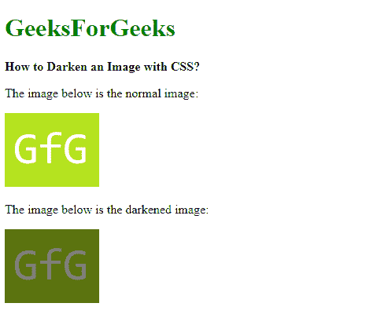
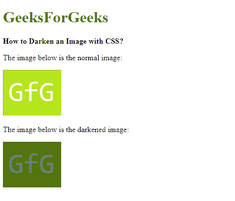

# 如何使用 CSS 使图像变暗？

> 原文:[https://www . geesforgeks . org/如何使用 css 使图像变暗/](https://www.geeksforgeeks.org/how-to-darken-an-image-using-css/)

**方法 1:使用滤镜属性:****滤镜**属性用于对元素应用各种图形效果。**亮度()**功能可以用作应用线性乘数的值，使其看起来比原始值更暗或更亮。要使图像变暗，任何低于 100%的值都可以用来使图像变暗该百分比。

**语法:**

```html
filter: brightness(50%)
```

**示例:**

```html
<!DOCTYPE html>
<html>

<head>
    <title>
        How to Darken an Image
        using CSS?
    </title>

    <style>
        .darkened-image {
            filter: brightness(50%);

            background-image: url(
'https://media.geeksforgeeks.org/wp-content/cdn-uploads/20191121162913/s11.png');
            height: 94px;
            width: 120px;
        }
    </style>
</head>

<body>
    <h1 style="color: green">
        GeeksForGeeks
    </h1>

    <b>
        How to Darken an Image
        with CSS?
    </b>

    <p>
        The image below is the
        normal image:
    </p>

    

    <p>
        The image below is the
        darkened image:
    </p>

    <div class="darkened-image"></div>
</body>

</html>
```

**输出:**


**方法 2:使用具有线性渐变的背景图像属性:**CSS 中的**背景图像**属性支持使用多个背景，这些背景相互叠加。使用线性渐变属性，黑色背景用作前层，要变暗的图像用作后层。背景图像属性的顺序指定了在定义后面的层之前首先要指定的前面的层。
可以改变黑色渐变的不透明度来控制变暗的量。这可以相应地用于根据需要使图像变暗。

**语法:**

```html
background-image: linear-gradient(rgba(0, 0, 0, 0.5),
                       rgba(0, 0, 0, 0.5)), url("url_of_image"))
```

**示例:**使用不透明度为 0.5 的背景渐变使图像变暗。

```html
<!DOCTYPE html>
<html>

<head>
    <title>
        How to Darken an Image with CSS?
    </title>

    <style>
        .darkened-image {
            background-image: 
            linear-gradient(rgba(0, 0, 0, 0.5), rgba(0, 0, 0, 0.5)),
            url(
'https://media.geeksforgeeks.org/wp-content/cdn-uploads/20191121162913/s11.png');
            height: 94px;
            width: 120px;
        }
    </style>
</head>

<body>
    <h1 style="color: green">
        GeeksForGeeks
    </h1>

    <b>
        How to Darken an Image
        with CSS?
    </b>

    <p>
        The image below is the
        normal image:
    </p>

    

    <p>
        The image below is the
        darkened image:
    </p>

    <div class="darkened-image"></div>
</body>

</html>
```

**输出:**


CSS 是网页的基础，通过设计网站和网络应用程序用于网页开发。你可以通过以下 [CSS 教程](https://www.geeksforgeeks.org/css-tutorials/)和 [CSS 示例](https://www.geeksforgeeks.org/css-examples/)从头开始学习 CSS。