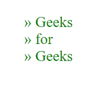
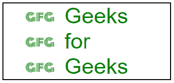

# 如何用 CSS 在箭头中修饰列表项目符号？

> 原文:[https://www . geesforgeks . org/how-to-修饰-列表-箭头中的项目符号-使用-css/](https://www.geeksforgeeks.org/how-to-decorate-list-bullets-in-arrow-using-css/)

给定一个项目列表，任务是自定义列表的项目符号样式，并用箭头替换它。

**方法 1:** 按 Unicode 字符

*   首先，我们将关闭列表的默认项目符号样式。
*   然后我们将在**“Li::在“**选择器之前”的内容属性中插入箭头字符的 Unicode。

**示例:**

```html
<!DOCTYPE html>
<html>

<head>
    <title>Decorating Bullet Style</title>

    <!-- Internal css -->
    <style type="text/css">

        <!-- Element selected by id -->
        #list{
            color: green;
            background: white;
            font-size: 30px;
        }

        <!-- Removes default style of 
        bullet point -->
        li{
            list-style: none;
        }

        <!-- ::before creates a pseudo-element
        that is the first child of the 
        selected element -->

        li::before{

            <!-- Unicode for >> character -->
            content: "\00BB";
        }
    </style>
</head>

<body>

    <!-- list of elements -->
    <ul id="list">
        <li> Geeks</li>
        <li> for</li>
        <li> Geeks</li>
    </ul>
</body>

</html>
```

**输出:**



**方法二:**

*   我们将在**“列表-样式-图像”**属性中插入我们想要插入的图像的网址来代替默认的项目符号样式。

**示例:**

```html
<!DOCTYPE html>
<html>

<head>
    <title>Decorating Bullet Style</title>

    <!-- Internal css -->
    <style type="text/css">

        <!-- Element selected by id -->
        #list{
            color: green;
            width: 300px;
            font-size: 45px;
            font-family: sans-serif;
            border:2px solid black;
        }

        ul{
            margin: 100px 100px;
        }

        <!-- Adds desired image at the 
        in place of default bullets -->
        li{
            list-style-image:URL(
'https://media.geeksforgeeks.org/wp-content/uploads/20200331172037/image47.png');
            list-style-position: inside;
        }
    </style>
</head>

<body>

    <!-- list of elements -->
    <ul id="list">
        <li> Geeks</li>
        <li> for</li>
        <li> Geeks</li>
    </ul>
</body>

</html>
```

**输出:**


**参考文献:**

*   [https://developer.mozilla.org/en-US/docs/Web/CSS/::before](https://developer.mozilla.org/en-US/docs/Web/CSS/::before)
*   [https://unicode-table.com/en/sets/arrow-symbols/](https://unicode-table.com/en/sets/arrow-symbols/)