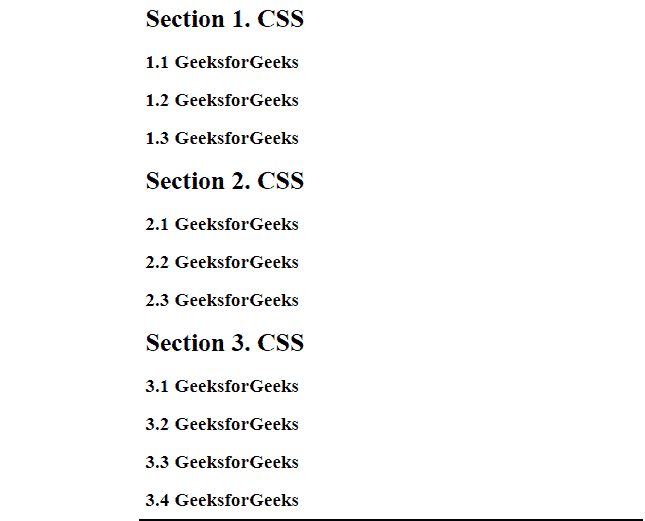

# 如何在 CSS 中定义一个有节数的节和子节？

> 原文:[https://www . geeksforgeeks . org/如何定义带有 css 中的部分的数字部分和子部分/](https://www.geeksforgeeks.org/how-to-define-a-number-sections-and-sub-sections-with-section-in-css/)

在本文中，我们将学习如何用 CSS 中的部分定义一些部分和子部分。[](https://www.geeksforgeeks.org/html-section-tag/)**标签定义了文档的章节，如章节、页眉、页脚或任何其他章节。区段标签将内容分为区段和子区段。**

**[**CSS 中的计数器**](https://www.geeksforgeeks.org/css-counters/) 基本上都是可以用于编号的变量，CSS 计数器的值可能会根据 CSS 规则进行递增。因此，为了解决这个任务，我们将使用以下 CSS 计数器属性。**

*   **[**counter-reset:**](https://www.geeksforgeeks.org/css-counter-reset-property/) It is used to reset a counter.

    **语法:**

    ```
    counter-reset: myCounter;
    ```** 
*   **[**counter-increment:**](https://www.geeksforgeeks.org/css-counter-increment-property/) It basically increments a counter value.

    **语法:**

    ```
    counter-increment: myCounter;
    ```** 
*   **[**内容:**](https://www.geeksforgeeks.org/css-counters/) 用于生成内容。**
*   **[**counter() or counters() function:**](https://www.geeksforgeeks.org/css-counters/) The value of a counter can be displayed using either the counter() or counters() function in a content property. These two functions basically used to add the value of a counter to the element.

    **语法:**

    ```
    content: counter(myCounter);
    ```** 

**通过以下步骤，我们可以用 CSS 中的节定义许多节和子节:**

**\**

*   ****步骤 1:** 首先，我们使用主体选择器中的计数器重置属性和 h2 选择器中的子部分为页面创建一个计数器。

    ```
    body {
      counter-reset: counter1;
    }
    h2{
      counter-reset: counter2;
    }
    ```** *   ****Step 2:** Now increment the value of the counter1 for each section and the counter2 value for each subsection using the *counter-increment* property and then add counter1 value before h2 and counter2 value before h3 using the *content* and the *counter()* property.

    ```
    h2:before {
       counter-increment: counter1;
       content: "Section " counter(counter1) ". ";
    }
    h3:before {
       counter-increment: counter2;
       content: counter(counter1) "." counter(counter2) " ";
    }
    ```

    **HTML 代码:**下面是上述方法的完整实现。

    ## 超文本标记语言

    ```
    <!DOCTYPE html>
    <html>
    <head>

        <style>
            div{
                color: green;
                font-size: 50px;
                margin: 50px 50px;
            }
            body {
                    counter-reset: counter1;
                }
                h2 {
                    counter-reset: counter2;
                }
                h2:before {
                    counter-increment: counter1;
                    content: "Section " counter(counter1) ". ";
                }
                h3:before {
                    counter-increment: counter2;
                    content: counter(counter1) "." counter(counter2) " ";
                }
        </style>
    </head>
    <body>
        <div>GeeksforGeeks</div>
        <h2>CSS</h2>
        <h3>GeeksforGeeks</h3>
        <h3>GeeksforGeeks</h3>
        <h3>GeeksforGeeks</h3>
        <h2>CSS</h2>
        <h3>GeeksforGeeks</h3>
        <h3>GeeksforGeeks</h3>
        <h3>GeeksforGeeks</h3>
        <h2>CSS</h2>
        <h3>GeeksforGeeks</h3>
        <h3>GeeksforGeeks</h3>
        <h3>GeeksforGeeks</h3>
        <h3>GeeksforGeeks</h3>
    </body>
    </html>
    ```

    **输出:**

    

    计数器输出**