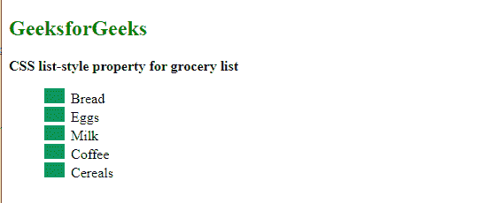
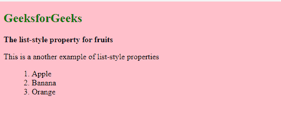

# 如何用 CSS 在一个声明中定义所有的列表属性？

> 原文:[https://www . geesforgeks . org/如何使用-css/](https://www.geeksforgeeks.org/how-to-define-all-the-list-properties-in-one-declaration-using-css/) 定义一个声明中的所有列表属性

有时一个网页有很好的阅读内容，但是文本的样式看起来不合适，所以它对读者来说变得无聊，最后，他们离开网页。但是当他们阅读具有适当风格和列表的文章时，他们会完全阅读，因为那里陈述的良好视觉效果使他们被文章和阅读吸引。

那么，如何增强网页上的文本和列表的视觉效果和样式呢？CSS 列表属性可以应用于 HTML 列表元素，如 [CSS *列表样式类型*](https://www.geeksforgeeks.org/css-list-style-type-property/) 、 [CSS *列表样式图像*](https://www.geeksforgeeks.org/css-list-style-image-property/) 、 [CSS *列表样式位置*](https://www.geeksforgeeks.org/css-list-style-position-property/) 属性，使其具有吸引力和醒目性。

在本文中，我们将学习声明列表属性并设置其样式。

**类型** [**HTML 列表**](https://www.geeksforgeeks.org/css-lists/) **:**

1.  [**有序列表**](https://www.geeksforgeeks.org/html-ol-tag/) **:** 物品列表，每个物品列表都标有数字。
2.  [**无序列表:**](https://www.geeksforgeeks.org/how-to-create-an-unordered-list-in-html/) 物品列表，每个物品列表都标有项目符号。

**样式列表属性:**

CSS 为最常用的无序和有序列表的样式和格式提供了几个属性。这些 CSS 列表属性通常允许您

*   控制元素的形状或外观。
*   为元素指定图像，而不是项目符号或编号。
*   设置列表中元素和文本之间的距离。
*   指定元素是出现在包含列表项的框内还是框外。

列表属性包含以下属性:

1.  **列表样式类型:**指定列表项标记的类型。值可以设置为*圆形、方形、罗马*字符等，默认值设置为*圆盘*。
2.  **列表样式位置:**指定列表项标记的位置或场所。这些值可以设置为*内部、外部(默认值)、继承、*和*初始*。
3.  **列表样式图像:**指定列表项标记的图像。

**注意:**[列表样式](https://www.geeksforgeeks.org/css-list-style-property/) 属性是另外三个属性*列表样式类型、列表样式位置、*和*列表样式图像*的组合，可以用作这三个属性的简写符号。

**语法:**

```css
list-style: list-style-type list-style-position list-style-image|
initial|inherit;
```

**示例 1:** 以下代码使用图像文件*“gfg 3 . png”*进行子弹造型。

## 超文本标记语言

```css
<!DOCTYPE html>
<html lang="en">

<head>
    <meta charset="UTF-8">
    <meta http-equiv="X-UA-Compatible" content="IE=edge">
    <meta name="viewport" content="width=device-width, initial-scale=1.0">
    <title>CSS List style Properties</title>
    <style>
        ul {
            list-style: square inside url("gfg3.png");
        }
    </style>
</head>

<body>
    <h2 style="color:green">GeeksforGeeks</h2>
    <b>CSS list-style property for grocery list</b>

    <ul>
        <li>Bread</li>
        <li>Eggs</li>
        <li>Milk</li>
        <li>Coffee</li>
        <li>Cereals</li>
    </ul>
</body>

</html>
```

**输出:**



列表样式属性

**例 2:**

## 超文本标记语言

```css
<!DOCTYPE html>
<html lang="en">

<head>
    <meta charset="UTF-8">
    <meta http-equiv="X-UA-Compatible" content="IE=edge">
    <meta name="viewport" content="width=device-width, initial-scale=1.0">
    <title>CSS Style List Properties</title>
    <style>
        body{
            background-color: pink;
        }
        ul{
            list-style: decimal inside none;
        }
    </style>
</head>

<body>
    <h2 style="color:green">GeeksforGeeks</h2>
    <b>The list-style property for fruits</b>

<p>This is a another example of list-style properties</p>

    <ul>
        <li>Apple</li>
        <li>Banana</li>
        <li>Orange</li>
    </ul>
</body>

</html>
```

**输出:**

