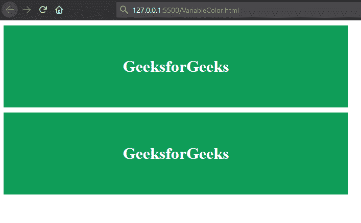

# 如何在 CSS 中将颜色定义为变量？

> 原文:[https://www . geesforgeks . org/如何将颜色定义为 css 中的变量/](https://www.geeksforgeeks.org/how-to-define-colors-as-variables-in-css/)

在 CSS 中，我们可以定义自定义属性(通常称为 CSS 变量)，这为我们定义一组规则提供了极大的灵活性，并避免了一次又一次地重写它们。我们还可以使用自定义属性来定义颜色。

**例 1:**

```html
<!DOCTYPE html>
<html>

<head>
    <title>
        How to define colors as variables in CSS?
    </title>
    <style>
        :root {
            --primary-color: rgb(15, 157, 88);
            --secondary-color: rgb(255, 255, 255);
        }

        .first {
            width: 50%;
            padding: 40px 0px;
            margin: 10px 0px;
            text-align: center;

            /* Apply color using CSS var */
            background-color: var(--primary-color);
            color: var(--secondary-color);
        }

        .second {

            width: 50%;
            padding: 40px 0px;
            text-align: center;

            /* Apply color using CSS var */
            background-color: var(--primary-color);
            color: var(--secondary-color);
        }
    </style>
</head>

<body>
    <div class="first">
        <h1>GeeksforGeeks</h1>
    </div>

    <div class="second">
        <h1>GeeksforGeeks</h1>
    </div>
</body>

</html>
```

**输出:**


**说明:**在上面的例子中，我们定义了两个有根范围的变量(可以跨整页使用)`--primary-color`和`--secondary-color`。然后，我们使用 CSS var()函数在第一类和第二类上使用了它们。

**注意:** `:root`选择器可以替换为任意本地选择器。此外，它将只限制该选择器中定义的变量的范围。

**例 2:**

```html
<!DOCTYPE html>
<html>

<head>
    <title>
        How to define colors as variables in CSS?
    </title>

    <style>
        .first {

            /* The defined colors are not scoped for
               .first class only
            */
            --primary-color: rgb(15, 157, 88);
            --secondary-color: rgb(255, 255, 255);

            width: 50%;
            padding: 40px 0px;
            margin: 10px 0px;
            text-align: center;

            /* Apply color using CSS var */
            background-color: var(--primary-color);
            color: var(--secondary-color);
        }

        .second {
            width: 50%;
            padding: 40px 0px;
            text-align: center;

            /* Apply color using CSS var */
            background-color: var(--primary-color);
            color: var(--secondary-color);
        }
    </style>
</head>

<body>
    <div class="first">
        <h1>GeeksforGeeks</h1>
    </div>

    <div class="second">
        <h1>GeeksforGeeks</h1>
    </div>
</body>

</html>
```

**输出:**
