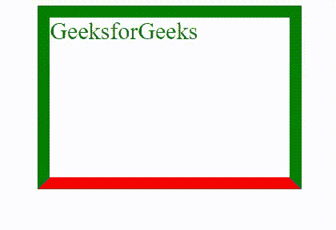

# 如何定义 CSS 中可动画化的边框底色？

> 原文:[https://www . geeksforgeeks . org/如何定义边框-底部颜色-可在 css 中设置动画/](https://www.geeksforgeeks.org/how-to-define-the-border-bottom-color-is-animatable-in-css/)

在本文中，我们将学习如何定义 CSS 中的边框-底部颜色。

**逼近:**[边框-底色](https://www.geeksforgeeks.org/css-border-bottom-color-property/)是下边框的颜色，我们想动画化它的颜色。为此，我们将使用 CSS 的动画属性。这需要三个值

*   首先是动画的名称，这是我们想要绑定的[关键帧](https://www.geeksforgeeks.org/css-keyframes-rule/)名称。

**语法:**

```
@keyframe myFun{
    100%{
        border-bottom-color: red;
    }
}
```

*   第二是它活跃的时间。
*   最后一个是我们想要动画的次数。

**语法:**

```
animation: animation_name animation_duration animation_count
```

**示例:**

## 超文本标记语言

```
<!DOCTYPE html>
<html>
<head>
    <title></title>
    <style>
        .gfg{
              width: 300px;
                height: 200px;
              border: solid 15px green;
              color: green;
              font-size: 30px;
              margin-left: 20%;
              animation: myFun 3s infinite;
        }
        @keyframes myFun {
            100%{
                border-bottom-color: red;
            }
        }
    </style>
</head>
<body>
    <div class="gfg">GeeksforGeeks</div>
</body>
</html>
```

**输出:**

