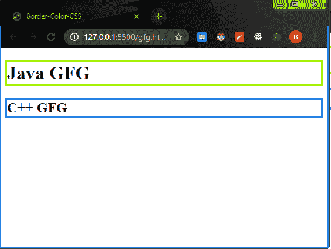
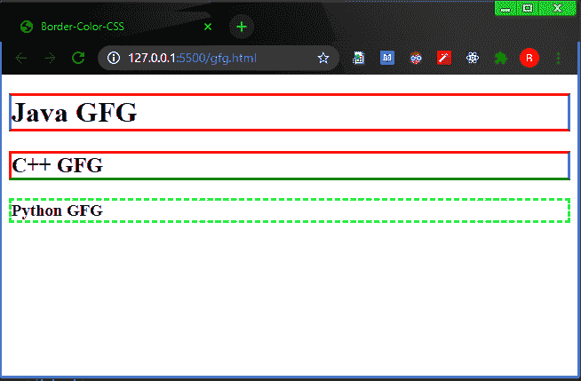

# 如何用 CSS 定义边框的颜色？

> 原文:[https://www . geeksforgeeks . org/如何使用 css 定义边框颜色/](https://www.geeksforgeeks.org/how-to-define-the-color-of-the-border-using-css/)

我们可以使用 [**边框**](https://www.geeksforgeeks.org/css-border-property/) 或 [***边框的颜色-颜色***](https://www.geeksforgeeks.org/css-border-color-property/) 属性。我们需要给 [*边框样式的*](https://www.geeksforgeeks.org/css-border-style-property/) 属性。

**进场:**

*   我们将使用 CSS 的[](https://www.geeksforgeeks.org/css-border-property/)**属性给出边框的颜色。**
*   **我们将给我们的 CSS 里面的标签也称为 [***【内联】***](https://www.geeksforgeeks.org/types-of-css-cascading-style-sheet/) 样式。**
*   **我们需要赋予[***边框样式的***](https://www.geeksforgeeks.org/css-border-style-property/) 属性以固、虚、双、隐等。**

****示例:****

## **超文本标记语言**

```html
<!DOCTYPE html>
<html>
<body>
 <h1 style="border: rgb(195, 255, 0);
            border-style: solid;">
    Java GFG
 </h1>
 <h2 style="border: rgb(0, 140, 255);
            border-style: solid;">
     C++ GFG
 </h2>
</body>
</html>
```

****输出:****

****

****方法 2:****

*   **在这个例子中，我们将使用 CSS [***边框-颜色***](https://www.geeksforgeeks.org/css-border-color-property/) 属性在头部部分的样式标签里面。它也被称为内部或嵌入式 CSS。**
*   **如果在 [*边框颜色*](https://www.geeksforgeeks.org/css-border-color-property/) 属性中给出两种颜色，那么第一种颜色代表顶部/底部，第二种颜色代表左右。**
*   **如果你给 4 种颜色，那么第一种是顶部，第二种是右侧，第三种，第四种是底部，左侧(顶部，右侧，底部，左侧)。**

****示例:****

## **超文本标记语言**

```html
<!DOCTYPE html>
<html>
<head>
    <style>
        h3{
            border-color:rgb(0, 255, 76);
            border-style: dashed;
        }
        h2{
             /* top->red right->blue bottom->green left->orange */
            border-color: red blue green orange;
            border-style: solid;
        }
        h1{
            /* top/bottom ->red  left/right->blue */
            border-color: red blue;
            border-style: solid;
        }

    </style>
</head>
<body>
 <h1>Java GFG</h1>
 <h2>C++ GFG</h2>
 <h3>Python GFG</h3>
</body>
</html>
```

****输出:****

**

边框颜色 CSS**