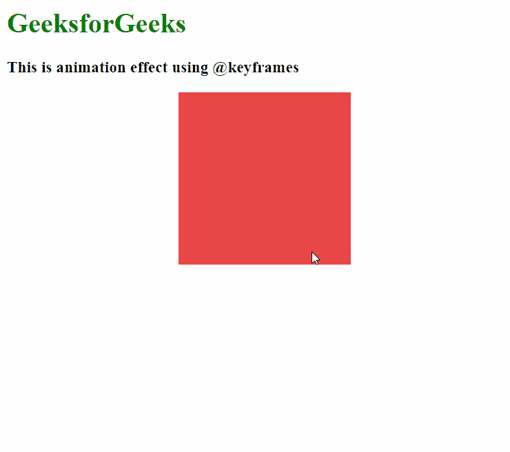
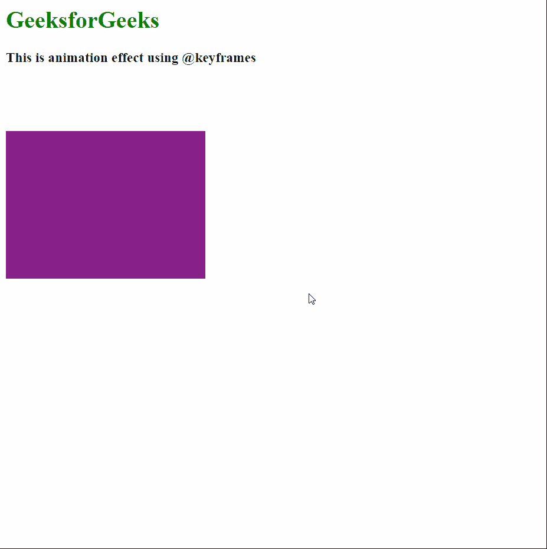

# 如何在 CSS 中定义绑定到选择器的关键帧的名称？

> 原文:[https://www . geesforgeks . org/如何定义绑定到 css 中选择器的关键帧名称/](https://www.geeksforgeeks.org/how-to-define-the-name-of-the-keyframe-that-binds-to-the-selector-in-css/)

最近，动画网站有所增加。在网页上编写和运行动画需要使用**关键帧**为正在执行动画的帧设置某种规则。在关键帧中写入所需属性时，我们基本上分配了一个从 0%到 100%不等的值。0%表示动画的开始，100%表示结束。关键词**从**和**到**，指定从哪一级到哪一级我们必须 100%运行动画。

绑定到选择器的关键帧的名称是使用**动画名称**属性定义的。**动画**属性也可用于将名称定义为其第一个属性。

**语法:**

```html
element-selector {
  animation-name: name;
}
```

以下示例演示了如何指定绑定到选择器的**关键帧**的名称。

**示例 1:** 使用动画名称属性。

## 超文本标记语言

```html
<html>
<head>
  <style>
    div {
      width: 200px;
      height: 200px;
      background: #731897;
      position: relative;

      /* Using the animation-name property
      to define the name of the animation */
      animation-name: GFG;
      animation-duration: 3s;
      animation-iteration-count: 5;
    }

    /* Define the animation to be used */
    @keyframes GFG {
      0% {
        top: 0px;
        left: 0px;
        background: #731897;
      }

      25% {
        top: 0px;
        left: 200px;
        background: #E94848;
      }

      50% {
        top: 200px;
        left: 200px;
        background: #51B43A;
      }

      75% {
        top: 200px;
        left: 0px;
        background: #484EE9;
      }

      100% {
        top: 0px;
        left: 0px;
        background: #731897;
      }
    }
  </style>
</head>
<body>
  <h1 style="color: green;">
    GeeksforGeeks
  </h1>
  <h3>
    This is animation effect
    using @keyframes
  </h3>
  <div></div>
</body>
</html>
```

**输出:**



**示例 2:** 使用动画属性。

## 超文本标记语言

```html
<html>
<head>
  <style>
    div {
      width: 200px;
      height: 200px;
      background: #731897;
      position: relative;

      /* Using the animation property
      to define all the parameters of the
      animation */
      animation: GFG 3s 5;
    }

    /* Define the animation to be used */
    @keyframes GFG {
      0% {
        top: 0px;
        background: #731897;
        width: 200px;
      }

      100% {
        top: 400px;
        background: #E94848;
        width: 600px;
      }
    }
  </style>
</head>
<body>
  <h1 style="color: green;">
    GeeksforGeeks
  </h1>
  <h3>
    This is animation effect
    using @keyframes
  </h3>
  <div></div>
</body>
</html>
```

**输出:**

