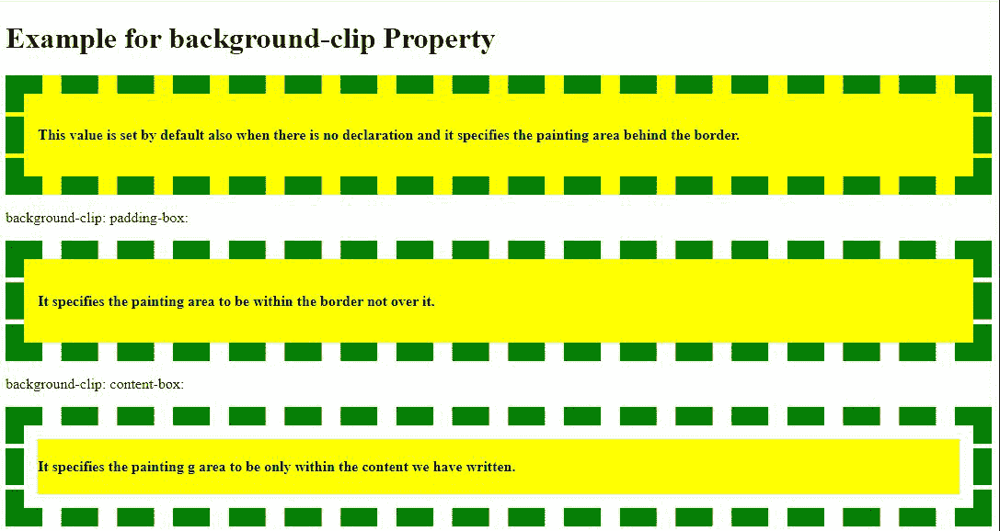
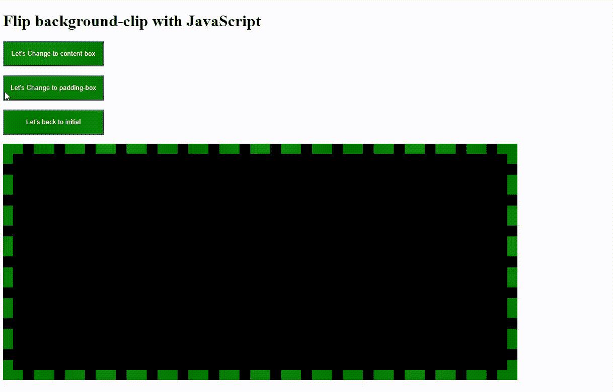

# 如何在 CSS 中定义背景的绘画区域？

> 原文:[https://www . geeksforgeeks . org/如何定义 css 背景中的绘画区域/](https://www.geeksforgeeks.org/how-to-define-the-painting-area-of-the-background-in-css/)

任务是定义背景的绘画区域。 [CSS 背景剪辑属性](https://www.geeksforgeeks.org/css-background-clip-property/)有一种平方度量受害的趋势，以勾勒出任何网页背景的绘画空间。它规定，在此范围内，我们将根据网页内容或包含的图像/视频修改网页背景。

**语法:**

```html
background-clip: border-box/padding-box/content-box/initial/inherit;
```

**该属性包含的值:**

对于不同的函数，平方主要度量这个属性的五个值，让我们看看它们是什么以及如何工作的。

<figure class="table">

| **Value**

 | **Description** |
| *Border-box* | This value is prepared by default union without declaration, and it specifies the drawing space behind the border. |
| *Filling box* | It specifies the drawing space between the borders that are not above it. |
| *Content box* | It stipulates that the painting space is only in what we write. |
| *Initial* | No matter what the previously declared property value is, as long as it is set to the default value again, the value of ***border*** can be indicated. |
| *Inherit* | It works because it has been named that it inherits the drawing space of its parent component. |

</figure>

#### 示例:

*   **使用属性值:**

## 超文本标记语言

```html
<!DOCTYPE html>
<html>

<head>
    <style>
        div {
            /* This sets CSS property of the border to
             be styled dashed and in green color with yellow 
             background having certain padding too */
            border: 20px dashed green;
            padding: 15px;
            background: yellow;
        }
    </style>
</head>

<body>

    <h1>Example for background-clip Property</h1>

    <div style="background-clip: border-box;">
        <!--This sets background-clip property to be border-box-->
        <h4>This value is set by default also when there is 
            no declaration and it specifies the painting
             area behind the border.</h4>
    </div>

<p>background-clip: padding-box:</p>

    <div style="background-clip: padding-box;">
        <!--This sets background-clip property to be padding-box-->
        <h4>It specifies the painting area to
          be within the border not over it.</h4>
    </div>

<p>background-clip: content-box:</p>

    <div style="background-clip: content-box;">
        <!--This sets background-clip property to be content-box-->
        <h4>It specifies the painting g area to be only 
            within the content we have written.</h4>
    </div>

</body>

</html>
```

**输出:**



*   **使用 JavaScript 翻转数值:**

## 超文本标记语言

```html
<!DOCTYPE html>
<html>

<head>
    <style>
        #GFG {
            /* This sets CSS property of the div which id is GFG to 
            be styled dashed and in green color with black background 
            having certain padding with background-clip to be 
            border-box by default*/
            width: 50%;
            height: 400px;
            padding: 15px;
            background-color: black;
            background-clip: border-box;
            border: 20px dashed green;
        }
    </style>
</head>

<body>

    <h1>Flip background-clip with JavaScript</h1>
    <!--These buttons works as per the onclick function 
        given to it and display the content accordingly-->
    <button onclick="myFunctionC()" style="width:200px;
                   height:50px;
                   background-color: black;
                   color:white">
            Let's Change to content-box
        </button>
    <br><br>
    <button onclick="myFunctionP()" style="width:200px;
                   height:50px;
                   background-color: black;
                   color:white">
            Let's Change to padding-box
        </button>
    <br><br>
    <button onclick="myFunctionI()" style="width:200px;
                   height:50px;
                   background-color: black;
                   color:white">
            Let's back to initial
        </button>
    <br><br>
    <div id="GFG">
    </div>

    <script>
        /* These are the functions which will be triggered when the 
           corresponding button will be clicked and sets the 
           CSS background-clip property accordingly */
        function myFunctionC() {
            document.getElementById(
                "GFG").style.backgroundClip = "content-box";
        }

        function myFunctionP() {
            document.getElementById(
                "GFG").style.backgroundClip = "padding-box";
        }

        function myFunctionI() {
            document.getElementById(
                "GFG").style.backgroundClip = "initial";
        }
    </script>

</body>

</html>
```

**输出:**

