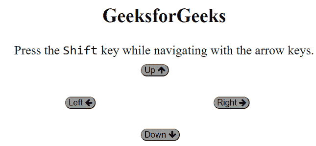

# 如何定义在 CSS 中使用箭头键导航到哪里？

> 原文:[https://www . geesforgeks . org/如何定义使用 css 中的箭头键导航到哪里/](https://www.geeksforgeeks.org/how-to-define-where-to-navigate-when-using-the-arrow-keys-in-css/)

在本文中，我们将学习如何定义在 CSS 中使用箭头键时的导航位置。

**进场:**我们可以通过一起使用*上导航、下导航、右导航*和*上导航* CSS 属性来完成这个任务。这些属性用于通过键盘上的导航键进行导航。属性定义了当用户使用导航键进行导航时的焦点位置。因此，通过使用这四个属性，我们可以在以下步骤中完成此任务:

*   当我们在左侧按钮时，我们将设置*右导航*和*下导航*值为#极客 2(上部按钮),设置*左导航*和*上导航*值为#极客 4(下部按钮)。
*   和其他按钮一样，我们可以通过键盘上的导航键进行导航。

**语法:**

```
nav-up: auto | id | target-name | initial | inherit;
nav-down: auto | id | target-name | initial | inherit;
nav-right: auto | id | target-name | initial | inherit;
nav-left: auto | id | target-name | initial | inherit;
```

**注意:**这些属性只支持 Opera 12.0。

**示例:**

## 超文本标记语言

```
<!DOCTYPE html>
<html>

<head>
    <link rel="stylesheet" href=
"https://cdnjs.cloudflare.com/ajax/libs/font-awesome/4.7.0/css/font-awesome.min.css">
    <style>
    body{
      font-size: 30px;
    }
        button {
            position: absolute;
        }

        h1 {
            color: green;
        }

        button {
            background-color: rgb(153, 153, 153);
            border-radius: 25px;
            font-size: 20px;
        }
        /*When we are on Left button we change it's 
         navigation using nav properties*/
        #Geeks1 {
            nav-right: #Geeks2; 
            nav-left: #Geeks4;
            nav-down: #Geeks2; 
            nav-up: #Geeks4;
            top: 35%;
            left: 43%;
            nav-index: 1;
        }
        /*When we are on top button we change it's 
         navigation using nav properties*/
        #Geeks2 {
            nav-right: #Geeks3; 
            nav-left: #Geeks1;
            nav-down: #Geeks3; 
            nav-up: #Geeks1;
            top: 50%;
            left: 65%;
            nav-index: 2;
        }
        /*When we are on right button we change it's 
         navigation using nav properties*/
        #Geeks3 {
            nav-right: #Geeks4; 
            nav-left: #Geeks2;
            nav-down: #Geeks4; 
            nav-up: #Geeks2;
            top: 65%;
            left: 43%;
            nav-index: 3;
        }
        /*When we are on bottom button we change it's 
         navigation using nav properties*/
        #Geeks4 {
            nav-right: #Geeks1; 
            nav-left: #Geeks3;
            nav-down: #Geeks1; 
            nav-up: #Geeks3;
            top: 50%;
            left: 20%;
            nav-index: 4;
        }
    </style>
</head>

<body>
    <center>
        <h2>GeeksforGeeks</h2>
        <p>
           Press the <samp>Shift</samp>
           key while navigating with the arrow keys.
        </p>

    </center>
    <button id="Geeks1">Up
        <i class="fa fa-arrow-up"></i>
    </button>
    <button id="Geeks2">Right
        <i class="fa fa-arrow-right"></i>
    </button>
    <button id="Geeks3">Down
        <i class="fa fa-arrow-down"></i>
    </button>
    <button id="Geeks4">Left
        <i class="fa fa-arrow-left"></i>
    </button>

</body>

</html>
```

**输出:**



箭号键