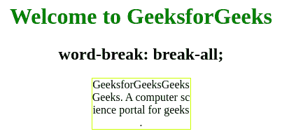
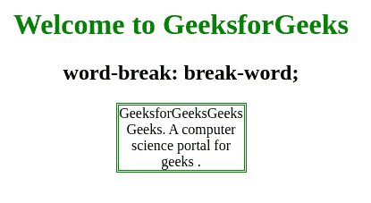
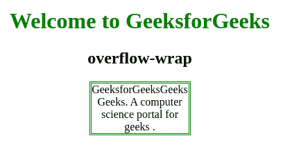

# 如何定义断字属性，让词在 CSS 中延续到下一行？

> 原文:[https://www . geesforgeks . org/如何定义单词-break-property-to-allow-word-to-continued-to-next-line-in-CSS/](https://www.geeksforgeeks.org/how-to-define-word-break-property-to-allow-words-to-be-continued-to-the-next-line-in-css/)

在本文中，我们将看到如何定义断字属性，以允许单词继续到 CSS 中的下一行。您可以使用**断字属性**和**断字属性**属性值来定义**断字属性**，该属性用于指定当单词到达行尾时如何断字。

**语法:**

```
word-break: break-all | break-word;
```

**属性值:**

*   **断字:**用于任意字符处断字，防止溢出。
*   **断字:**用于任意点断字，防止溢出。

**例 1:**

## 超文本标记语言

```
<!DOCTYPE html>
<html>

<head>
    <style>
        h1 {
            color: green;
        }

        .gfg {
            width: 140px;
            border: 1px solid #CCFF00;
            word-break: break-all;
        }
    </style>
</head>

<body>
    <center>
        <h1>Welcome to GeeksforGeeks </h1>

        <h2>word-break: break-all;</h2>
        <p class="gfg">
            GeeksforGeeksGeeksGeeks. A computer 
            science portal for geeks.
        </p>
    </center>
</body>

</html>
```

**输出:**



**例 2:**

## 超文本标记语言

```
<!DOCTYPE html>
<html>

<head>
    <style>
        h1 {
            color: green;
        }

        .gfg {
            width: 140px;
            border: 3px double green;
            word-break: break-word;
        }
    </style>
</head>

<body>
    <center>
        <h1>Welcome to GeeksforGeeks </h1>

        <h2>word-break: break-word;</h2>
        <p class="gfg">
            GeeksforGeeksGeeksGeeks. A computer 
            science portal for geeks.
        </p>
    </center>
</body>

</html>
```

**输出:**



**示例 3:** 在本例中，我们将使用**溢出包装**属性。

**语法:**

```
 overflow-wrap: break-word;
```

## 超文本标记语言

```
<!DOCTYPE html>
<html>

<head>
    <style>
        h1 {
            color: green;
        }

        .gfg {
            width: 140px;
            border: 3px double green;
            overflow-wrap: break-word;
        }
    </style>
</head>

<body>
    <center>
        <h1>Welcome to GeeksforGeeks </h1>

        <h2>overflow-wrap</h2>
        <p class="gfg">
            GeeksforGeeksGeeksGeeks. A computer 
            science portal for geeks.
        </p>
    </center>
</body>

</html>
```

**输出:**



**支持的浏览器:**

*   谷歌 Chrome
*   微软公司出品的 web 浏览器
*   火狐浏览器
*   歌剧
*   旅行队