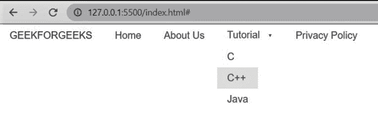
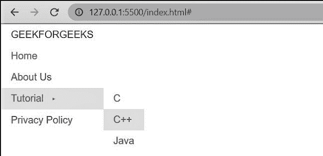

# 如何用纯 CSS 设计下拉菜单？

> 原文:[https://www . geesforgeks . org/how-design-a-drop-menu-use-pure-CSS/](https://www.geeksforgeeks.org/how-to-design-a-dropdown-menu-using-pure-css/)

下拉菜单是我们现在在网上看到的一种常见的用户界面模式。它在显示相关信息时非常有用，不会让用户被按钮、文本和选项所淹没。大多数时候，它出现在导航栏或网站的标题中。

在纯 CSS 的帮助下，我们可以很容易地创建这样的下拉菜单。

**方法:**创建带下拉菜单的水平菜单考虑以下几点。

*   菜单的所有组件都应包含在一个名为**“**”的类中-菜单纯-菜单-水平**“**”。
*   在主标题或标题的< span >元素中添加类**纯菜单标题**。****
*   ****然后用类**“**纯菜单列表**“**添加

    **“**

    **“****** 
*   ****要为特定列表项创建下拉菜单，请在< li >元素中添加类**“**纯菜单有子菜单**”**。添加类名 **"** 纯-菜单-允许-悬停 **"** 显示悬停时的子菜单。将< ul >元素内的子菜单的所有项目添加到类**“**纯菜单-子菜单**”**。每个项目应包含在等级为**“**纯菜单项**“**的< li >元素中。****
*   ****如果你想链接一个项目到你的网页的一个部分，你可以用类**“**纯菜单链接**”**进一步把它包含在****

******示例:**在本例中，我们将创建一个水平菜单。****

## ****超文本标记语言****

```
**<!DOCTYPE html>
<html>
  <head>
    <!--Import Pure Css files-->
    <link rel="stylesheet"
          href=
"https://unpkg.com/purecss@1.0.0/build/pure-min.css"
          integrity=
"sha384-nn4HPE8lTHyVtfCBi5yW9d20FjT8BJwUXyWZT9InLYax14RDjBj46LmSztkmNP9w"
      crossorigin="anonymous"/>

    <!-- Let browser know website is 
        optimized for mobile -->
    <meta name="viewport" 
          content="width=device-width, initial-scale=1.0" />
  </head>

  <body>
    <div class="pure-menu pure-menu-horizontal">
      <!--Main heading of menu-->
      <span class="pure-menu-heading"> 
        GEEKFORGEEKS 
      </span>

      <ul class="pure-menu-list">
        <!--List items of menu-->
        <li class="pure-menu-item">
          <a href="#" class="pure-menu-link">
            Home 
          </a>
        </li>
        <li class="pure-menu-item">
          <a href="#" class="pure-menu-link"> 
            About Us 
          </a>
        </li>
        <li class="pure-menu-item pure-menu-has-children 
                   pure-menu-allow-hover">
          <a href="#" class="pure-menu-link">
            Tutorial 
          </a>

          <!--Submenus of Tutorial-->
          <ul class="pure-menu-children">
            <li class="pure-menu-item">
              <a href="#" class="pure-menu-link">C</a>
            </li>
            <li class="pure-menu-item">
              <a href="#" class="pure-menu-link">C++</a>
            </li>
            <li class="pure-menu-item">
              <a href="#" class="pure-menu-link">Java</a>
            </li>
          </ul>
        </li>
        <li class="pure-menu-item">
          <a href="#" class="pure-menu-link">
            Privacy Policy 
          </a>
        </li>
      </ul>
    </div>
  </body>
</html>**
```

******输出**:****

********

******创建带下拉菜单的垂直菜单:**要创建这样的菜单，请从开始处的分区中删除类名**“**-纯菜单-水平**”**。默认情况下，菜单项占容器宽度的 100%，因此我们必须通过将显示设置为内嵌块来限制宽度。****

******示例:**在本例中，我们将创建一个垂直菜单。****

## ****超文本标记语言****

```
**<!DOCTYPE html>
<html>
  <head>
    <!--Import Pure Css files-->
    <link rel="stylesheet"
          href=
"https://unpkg.com/purecss@1.0.0/build/pure-min.css"
          integrity=
"sha384-nn4HPE8lTHyVtfCBi5yW9d20FjT8BJwUXyWZT9InLYax14RDjBj46LmSztkmNP9w"
          crossorigin="anonymous" />

    <!-- Let browser know website is 
        optimized for mobile -->
    <meta name="viewport" content="width=device-width, initial-scale=1.0" />
  </head>

  <body>
    <style>
      .custom-restricted-width {
        /* To limit the menu width to 
            the content of the menu: */
        display: inline-block;
      }
    </style>

    <div class="pure-menu custom-restricted-width">
      <!--Main heading of menu-->
      <span class="pure-menu-heading"> GEEKFORGEEKS </span>

      <ul class="pure-menu-list">
        <!--List items of menu-->
        <li class="pure-menu-item">
          <a href="#" class="pure-menu-link"> Home </a>
        </li>
        <li class="pure-menu-item">
          <a href="#" class="pure-menu-link"> About Us </a>
        </li>
        <li class="pure-menu-item pure-menu-has-children
                   pure-menu-allow-hover">
          <a href="#" class="pure-menu-link"> Tutorial </a>

          <!--Submenus of Tutorial-->
          <ul class="pure-menu-children">
            <li class="pure-menu-item">
              <a href="#" class="pure-menu-link">C</a>
            </li>
            <li class="pure-menu-item">
              <a href="#" class="pure-menu-link">C++</a>
            </li>
            <li class="pure-menu-item">
              <a href="#" class="pure-menu-link">Java</a>
            </li>
          </ul>
        </li>
        <li class="pure-menu-item">
          <a href="#" class="pure-menu-link"> 
             Privacy Policy
          </a>
        </li>
      </ul>
    </div>
  </body>
</html>**
```

******输出:******

********