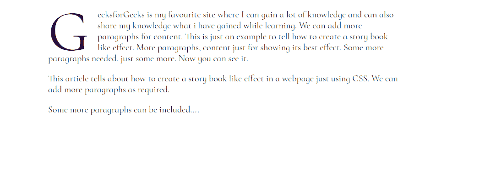

# 如何用 CSS 设计文字段落的首字母？

> 原文:[https://www . geesforgeks . org/how-to-design-initial-letter-text-段落-use-CSS/](https://www.geeksforgeeks.org/how-to-design-initial-letter-of-text-paragraph-using-css/)

有时一个网页包含了很好的阅读内容，但是文本的样式看起来简单而直截了当，所以读者阅读它会变得很无聊，他们会离开网页。但是当他们读故事书的时候，他们读得很充分，因为那本书的视觉效果很好，所以他们完成了这本书的阅读。那么，如何增强网页中文本的视觉效果和样式呢？

本文将告诉你如何仅使用 **HTML 和 CSS** 在网页中创建一个类似**的故事书效果**。

在编写代码之前，您只需要在程序中为**字体系列包含以下样式表:鸬鹚幼鸟**

> <link href="”https://fonts.googleapis.com/css2?family=Cormorant+Infant&amp;display=swap”" rel="”stylesheet”">

**例:**

## 超文本标记语言

```css
<!DOCTYPE html>
<html>

<head>
    <title>GeeksforGeeks</title>
    <link href=
"https://fonts.googleapis.com/css2?family=Cormorant+Infant&display=swap"
        rel="stylesheet">

    <style type="text/css">
        p.para1:first-letter {
            font-size: 100px;
            display: block;
            float: left;
            line-height: 0.5;
            margin: 15px 15px 10px 0;
        }

        body {
            font-size: 1rem;
            width: 40%;
            margin: auto;
            font-family: cormorant infant;
        }
    </style>
</head>

<body>
    <p class="para1">
        GeeksforGeeks is my favourite site where 
        I can gain a lot of knowledge and can 
        also share my knowledge what i have 
        gained while learning. We can add more 
        paragraphs for content. This is just an 
        example to tell how to create a story 
        book like effect. More paragraphs, 
        content just for showing its best effect. 
        Some more paragraphs needed. Just some 
        more. Now you can see it.
    </p>

    <p>
        This article tells about how to create 
        a story book like effect in a webpage 
        just using CSS. We can add more 
        paragraphs as required.
    </p>

    <p>Some more paragraphs can be included....</p>
</body>

</html>
```

**Output:**


现在，正如你在**输出**中看到的，我们已经创建了一个漂亮的**故事书般的效果**，它将吸引读者阅读网页上的内容。