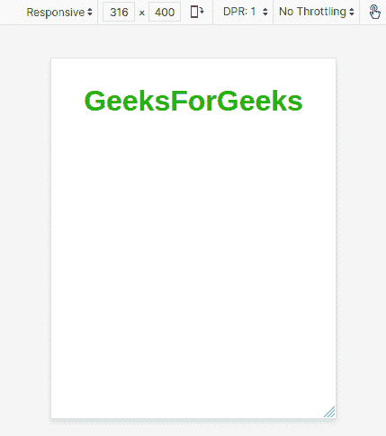
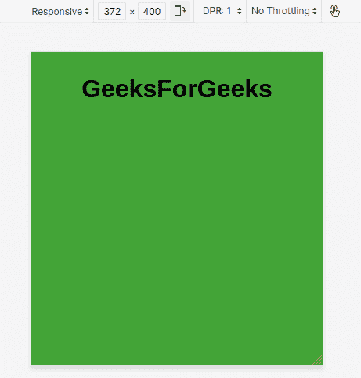
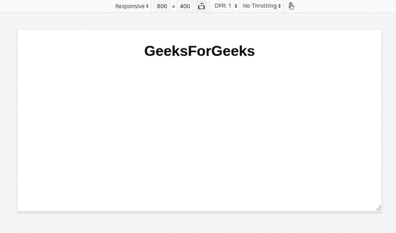

# 如何检测设备并交换 CSS 文件？

> 原文:[https://www . geesforgeks . org/如何检测设备并交换 css 文件/](https://www.geeksforgeeks.org/how-to-detect-device-and-swap-the-css-file/)

创建网页时，最重要的是前端的用户体验，尤其是设计部分或 CSS。为了获得流畅的体验，前端开发人员需要让网页具有响应性。由于“一种尺寸不适合所有人”，单一设计无法适用于所有设备。这就是引入“媒体查询”的原因。当涉及到根据屏幕宽度、高度、位/像素等等来设计网站的特定部分时，媒体查询非常有用。
但如果要写很多媒体查询，或者我们必须完全改变不同设备的网页样式，写媒体查询有时会令人困惑。所以，我们可以针对不同的屏幕尺寸使用不同的 CSS 文件。

这可以通过在 HTML 文件的<link rel="”stylesheet”" href="”style.css”">部分添加媒体查询来实现。

媒体查询可以添加到 CSS 的链接部分，如下所示

```css
<link rel="stylesheet" media="media query properties" href="stylesheet.css">
```

**可以使用的媒体类型**

<figure class="table">

| 全部(默认) | 用于所有媒体类型设备 |
| 打印 | 用于打印机 |
| 屏幕 | 用于电脑屏幕、平板电脑、智能手机等。 |
| 演讲 | 用于大声“阅读”页面的屏幕阅读器 |

</figure>

**使网页具有响应性的一些常用媒体功能**

<figure class="table">

| maximum width | Sets the maximum width that CSS properties will follow. |
| minimum widith | Sets the minimum width that CSS properties will follow. |
| direction | Can be set to portrait/landscape. |

</figure>

**注意:**将 CSS 链接到 HTML 时，可以使用媒体查询的所有功能。

## index.html

```css
<doctype html="html">
    <html lang="en" dir="ltr">
        <head>
            <title>GFG</title>

            <!-- main css -->
            <link rel="stylesheet" href="master.css">

            <!-- CSS with media query -->
            <link rel="stylesheet" 
              media="screen and (max-width: 360px)" 
              href="small-screen.css">
            <link rel="stylesheet" 
              media="screen and (min-width: 360px) and (max-width: 550px)" 
              href="large-screen.css">

        </head>

        <body>
            GeeksForGeeks
        </body>

    </html>
```

**CSS Files:**

*   **1。master.css 文件**

    ## master.css

    ```css
    // master.css

    body {
        display: flex;
        align-items: center;
        font-family: sans-serif;
    }
    ```

*   **2。小屏幕. css 文件**

    ## 小屏幕. css

    ```css
    // small-screen.css

    body {
        color: rgb(29, 176, 5);
        background-color: white;
    }
    ```

*   **3。大屏幕. css 文件**

    ## 大屏幕. css

    ```css
    // large-screen.css

    body {
        color: rgb(67, 164, 55);
        background-color: black;
    }
    ```

**输出:**



当屏幕宽度小于 360 像素时



当屏幕宽度大于 360 像素且小于 550 像素时



当屏幕宽度大于 550 像素时