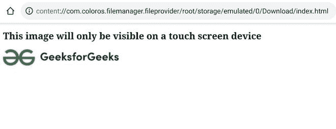
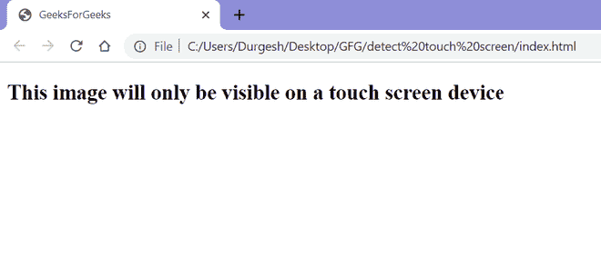

# 如何使用 CSS 检测触摸屏设备？

> 原文:[https://www . geesforgeks . org/如何检测-触摸屏-设备-使用-css/](https://www.geeksforgeeks.org/how-to-detect-touch-screen-device-using-css/)

在网站中，检测用户使用的定点设备变得很重要。例如，如果用户使用手指作为定点设备(由于更多的屏幕-手指接触区域，它在屏幕上的精确度较低)，那么我们应该增加各种元素的大小，如按钮、链接、输入字段等。使得用户在使用网站时感到舒适。

使用 CSS 媒体查询或使用 [JavaScript 可以轻松检测到触摸屏设备。](https://www.geeksforgeeks.org/how-to-detect-touch-screen-device-using-javascript/)

仅 HTML 无法检测触摸屏设备。除了 HTML，我们还需要 CSS 媒体查询。在 CSS 媒体查询中，我们有一个名为 ***指针*** 的功能，用于检测用户使用的指点设备的指点精度。它有以下 3 个值。

*   **指针:** ***无:*** 当设备的输入机制没有指向设备时触发。
*   **指针:** ***粗:*** 当指点设备的输入机制精度较低时触发。例如，触摸屏。
*   **指针:** ***精细:*** 当指点设备的输入机制精度较高时触发。例如，鼠标、触控板、手写笔等。

**HTML 代码:**以下代码检测用户是否正在使用触摸屏设备。

## 超文本标记语言

```html
<!-- HTML code to detect a touch
    screen device  -->
<!DOCTYPE html>
<html lang="en">

<head>
    <style>

        /* By default, setting the 
        image display to none */
        #image-GFG {
            display: none;
        }

        /* In case of touch-screen device,
        setting image display to block.
        Using @media to detect pointer 
        accuracy */
        @media (pointer:coarse) {
            #image-GFG {
                display: block;
            }
        }
    </style>
</head>

<body>
    <h2>
        This image will only be visible on 
        a touch screen device
    </h2>

    
</body>

</html>
```

**输出:**

*   **触摸屏输出:**



智能手机的输出

*   **非触摸屏输出:**



从非触摸屏桌面输出

**注意:**要在智能手机上测试输出，请将上述代码复制到. html 文件中，并将其传输到智能手机，然后使用 Chrome 或 Safari 等任何浏览器打开。