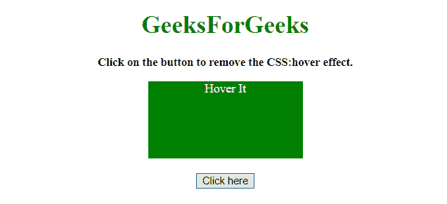
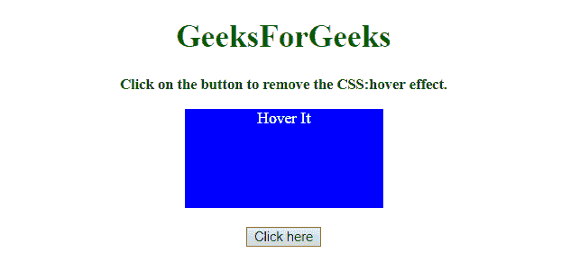
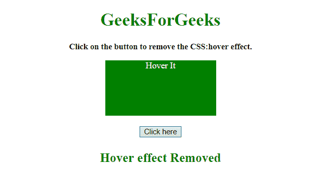

# 如何禁用一个 CSS:悬停效果？

> 原文:[https://www . geesforgeks . org/如何禁用-a-css-hover-effect/](https://www.geeksforgeeks.org/how-to-disable-a-css-hover-effect/)

任务是从元素中移除 CSS:hover 属性。这里我们将使用 JavaScript 来解决这个问题。
**进场 1:**

*   只需通过**移除正在使用 JQuery 向元素添加悬停效果的类。removeClass()方法**。

**示例 1:** 该示例使用上述方法。

```
<!DOCTYPE HTML>  
<html>  
    <head> 
        <title> 
          How to Disable a CSS :hover effect.
        </title>
        <script src=
"https://ajax.googleapis.com/ajax/libs/jquery/3.4.1/jquery.min.js">    
        </script>
        <style>
           .element {
               height: 100px;
               width: 200px;
               background: green;
               color: white;
               margin: 0 auto;
           }
           .hover:hover {
               background: blue;
           }
        </style>
    </head> 
    <body style = "text-align:center;" id = "body">  
        <h1 id = "h1" style = "color:green;" >  
            GeeksForGeeks  
        </h1>
        <p id = "GFG_UP" style = "font-size: 15px; font-weight: bold;">
        </p>
        <div id = "div" class = "element hover">
            Hover It
        </div>
        <br>
        <button onclick = "gfg_Run()"> 
            Click here
        </button>
        <p id = "GFG_DOWN" style = "font-size: 23px; 
           font-weight: bold; color: green; ">
        </p>
        <script>
            var el_up = document.getElementById("GFG_UP");
            var el_down = document.getElementById("GFG_DOWN");
            var heading = document.getElementById("h1");
            var div = document.getElementById("div");
            el_up.innerHTML = 
            "Click on the button to remove the  CSS:hover effect.";
            function gfg_Run() {
                $('#div').removeClass('hover');
                el_down.innerHTML = "Hover effect Removed";
            }         
        </script> 
    </body>  
</html>
```

**输出:**

*   点击按钮前:
    
*   悬停在元素上时:
    
*   点击按钮后:
    

**方法 2:**

*   只需通过 **.classList.remove()方法**移除正在使用 JavaScript 向元素添加悬停效果的类。

**示例 2:** 该示例使用上述方法。

```
<!DOCTYPE HTML>  
<html>  
    <head> 
        <title> 
           How to Disable a CSS :hover effect.
        </title>
        <style>
           .element {
               height: 100px;
               width: 200px;
               background: green;
               color: white;
               margin: 0 auto;
           }
           .hover:hover {
               background: blue;
           }
        </style>
    </head> 
    <body style = "text-align:center;" id = "body">  
        <h1 id = "h1" style = "color:green;" >  
            GeeksForGeeks  
        </h1>
        <p id = "GFG_UP" style = "font-size: 15px; 
           font-weight: bold;">
        </p>
        <div id = "div" class = "element hover">
            Hover It
        </div>
        <br>
        <button onclick = "gfg_Run()"> 
            Click here
        </button>
        <p id = "GFG_DOWN" style = "font-size: 23px; font-weight: 
           bold; color: green; ">
        </p>
        <script>
            var el_up = document.getElementById("GFG_UP");
            var el_down = document.getElementById("GFG_DOWN");
            var heading = document.getElementById("h1");
            var div = document.getElementById("div");
            el_up.innerHTML = 
            "Click on the button to remove the  CSS:hover effect.";
            function gfg_Run() {
          document.getElementById('div').classList.remove("hover");
                el_down.innerHTML = "Hover effect Removed";
            }         
        </script> 
    </body>  
</html>
```

**输出:**

*   点击按钮前:
    
*   悬停在元素上时:
    
*   点击按钮后:
    