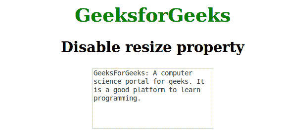

# 如何使用 CSS 禁用 textarea 的可调整大小属性？

> 原文:[https://www . geeksforgeeks . org/how-disable-resized-property-of-textarea-using-CSS/](https://www.geeksforgeeks.org/how-to-disable-resizable-property-of-textarea-using-css/)

此可调整大小的属性用于设置元素的可调整大小区域。它主要用于 textarea 和 div 元素。若要禁用元素的可调整大小属性，请使用“调整大小为无”。这是默认值。

**语法**

```css
resize: none;
```

**示例:**

```css
<!DOCTYPE html>
<html>
    <head>
        <title>Disable resize property</title>
        <style> 
            h1 {
                color:green;
            }
            body {
                text-align:center;
            }
            textarea {
                overflow:auto;
                resize:none;
                width:200px;
                height:100px;
            }
        </style>
    </head>
    <body>
        <h1>GeeksforGeeks</h1>
        <h2>Disable resize property</h2>
        <textarea>GeeksForGeeks: A computer science portal for 
        geeks. It is a good platform to learn programming.
        </textarea>
    </body>
</html>                    
```

**输出:**


**支持的浏览器:**resize 属性支持的浏览器如下:

*   苹果 Safari 4.0
*   谷歌 Chrome 4.0
*   Firefox 5.0
*   Opera 15.0