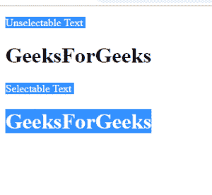

# 如何使用 CSS 禁用文本选择高亮？

> 原文:[https://www . geesforgeks . org/如何禁用-文本-选择-突出显示-使用-css/](https://www.geeksforgeeks.org/how-to-disable-text-selection-highlighting-using-css/)

使文本不可选择是一项简单的任务。我们所要做的就是对网页可能加载的所有浏览器禁用网页上文本的选择性。CSS 中使用了一些设置/命令，用于在特定浏览器上启用/禁用功能。就像在我们的网页上禁用某个功能，比如禁用文本的选择性，我们将不得不对所有可用的浏览器分别禁用它，否则它将不适用于所有浏览器。
**让我们看看我们在不同的浏览器中使用什么语句来禁用文本的选择性。**

*   **Chrome，Opera**:-WebKit-用户-选择
*   **Safari**:-网络工具包-触摸-标注
*   **Mozilla**:-Moz-用户-选择
*   **互联网浏览器**:-毫秒-用户-选择

**代码**

```css
<!DOCTYPE html>
<html>
<head>
    <title></title>
</head>

<style type="text/css">
    .disable-text{
        -webkit-user-select:none;
        -webkit-touch-callout:none;
             -moz-user-select:none;
             -ms-user-select:none;
             user-select:none;   

       }

</style>
<body>
<p>Unselectable Text</p>
<div class="disable-text">
<h1>GeeksForGeeks</h1>
</div>
<div>
<p>Selectable Text</p> <h1>GeeksForGeeks</h1></div>
</body>
</html>
```

**输出**

**注意**出现在“禁用文本”div 中的文本不会被选择，其余一切都是可选的，如输出图像所示。