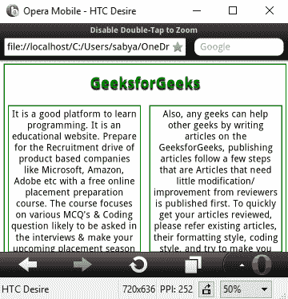
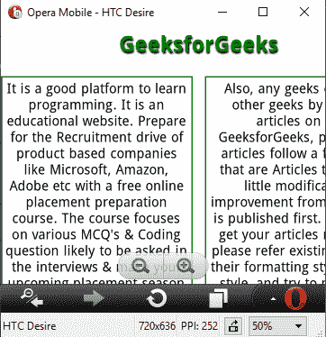
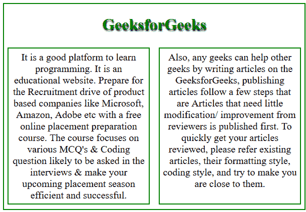
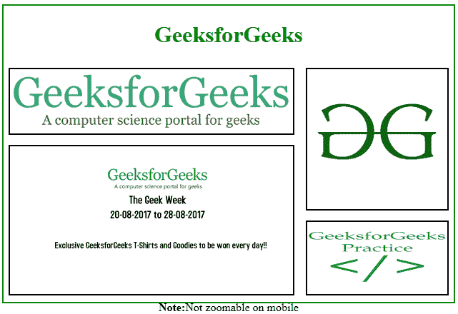

# 如何使用 CSS 禁用移动网页缩放？

> 原文:[https://www . geesforgeks . org/如何使用 css 禁用移动网页缩放/](https://www.geeksforgeeks.org/how-to-disable-zoom-on-a-mobile-web-page-using-css/)

要禁用多点触控手势的缩放选项，我们可以使用 **surefox** 浏览器，但用户仍然可以通过双击屏幕来放大或缩小。我们可以使用< meta >标签来禁用移动网页的放大和缩小。
**语法:**

```css
<meta name="viewport" content= "width=device-width, user-scalable=no">
```

**在移动浏览器上实现的步骤:**

*   [下载](https://www.opera.com/developer/mobile-emulator) opera 手机模拟器
*   安装下载的文件，并运行模拟器。
*   从列表中选择您的设备首选设备。
*   将文件拖到模拟器中运行不可缩放文件。

**不可缩放示例:**



**可缩放示例:**



**示例:**本示例使用用户可缩放=否禁用移动网页缩放。

## 超文本标记语言

```css
<!DOCTYPE html>
<html>

<head>
    <title>
        Disable Double-Tap to Zoom
    </title>

    <meta meta name="viewport" content=
            "width=device-width, user-scalable=no" />

    <style>
        body {
            height:410px;
            width:600px;
            border: 2px solid green;
        }
        p {    
            font-size:20px;
            padding:5px;
            margin:7px;
            width:270px;
            height:300px;
            border:2px solid green;
        }
    </style>
</head>

<body>
    <center>
        <h1 style="color:green;text-shadow: 1px 3px 2px #000">
            GeeksforGeeks
        </h1>

        <div>
            <p style=" float:left; ">
                It is a good platform to learn programming.
                It is an educational website. Prepare for the
                Recruitment drive of product based companies
                like Microsoft, Amazon, Adobe etc with a free
                online placement preparation course. The
                course focuses on various MCQ's & Coding
                question likely to be asked in the interviews
                & make your upcoming placement season
                efficient and successful.
            </p>

            <p style="float:right;">
                Also, any geeks can help other geeks by writing
                articles on the GeeksforGeeks, publishing
                articles follow a few steps that are Articles
                that need little modification/improvement from
                reviewers is published first. To quickly get
                your articles reviewed, please refer existing
                articles, their formatting style, coding style,
                and try to make you are close to them.
            </p>

        </div>
    </center>
</body>

</html>                                       
```

**输出:**



**示例 2:** 本示例使用用户可缩放=否禁用移动网页缩放。

## 超文本标记语言

```css
<!DOCTYPE html>
<html>

<head>   
    <title>
        Disable Double-Tap to Zoom
    </title>

    <meta meta name="viewport" content=
            "width=device-width, user-scalable=no" />
    <style>
        body {
            height:415px;
            width:630px;
            border: 2px solid green;
        }
    </style>
</head>

<body>
    <center>
        <h1 style="color:green">
            GeeksforGeeks
        </h1>

        

        

        

        

<p><b>Note:</b>Not zoomable on mobile</p>

    </center>
</body>
</html>                                                  
```

