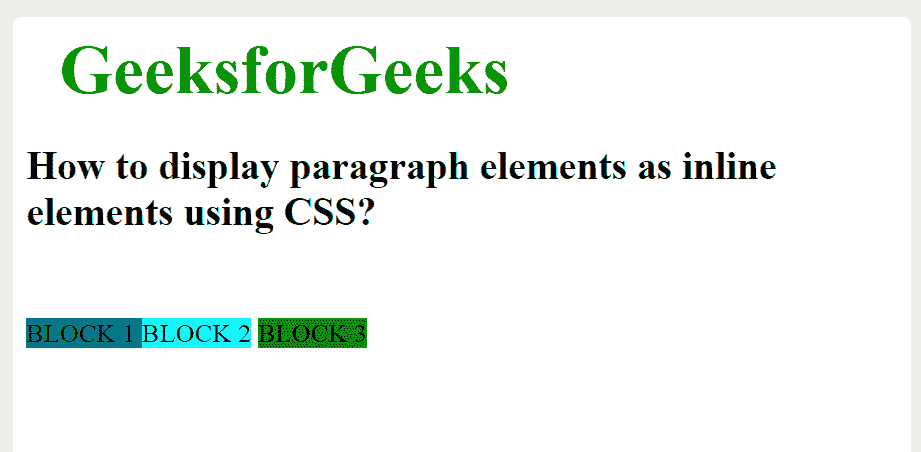

# 如何使用 CSS 将段落元素显示为内嵌？

> 原文:[https://www . geesforgeks . org/how-display-段落-元素-as-inline-use-CSS/](https://www.geeksforgeeks.org/how-to-display-paragraph-elements-as-inline-using-css/)

本文的目的是使用 CSS 将段落元素显示为*内联*元素。CSS 中的*显示*属性用于在网页上放置组件(“div”、“超链接”、“标题”等)。*显示*属性设置为*直列*。它有“锚”标签的默认属性。它用于将“div”以水平方式内联放置。*显示*属性的*内嵌*选项忽略用户设置的“宽度”和“高度”。

**语法:**

```html
display: inline; 
```

**示例:**

## 超文本标记语言

```html
<!DOCTYPE html>
<html>

<head>
    <style>
        #main {
            height: 200px;
            width: 200px;
            background: teal;
            display: inline;
        }

        #main1 {
            height: 200px;
            width: 200px;
            background: cyan;
            display: inline;
        }

        #main2 {
            height: 200px;
            width: 200px;
            background: green;
            display: inline;
        }

        .gfg {
            margin-left: 20px;
            font-size: 42px;
            font-weight: bold;
            color: #009900;
        }

        .geeks {
            font-size: 25px;
            margin-left: 30px;
        }

        .main {
            margin: 50px;
        }
    </style>
</head>

<body>
    <div class="gfg">GeeksforGeeks</div>
    <h2>
        How to display paragraph elements 
        as inline elements using CSS?
    </h2>

    <p class="main">
    <p id="main"> BLOCK 1 </p>
    <p id="main1"> BLOCK 2</p>
    <p id="main2">BLOCK 3 </p>
    </p>
</body>

</html> 
```

**输出:**



**支持的浏览器如下:**

*   google chromeinternet explorer
*   火狐浏览器
*   歌剧
*   旅行队