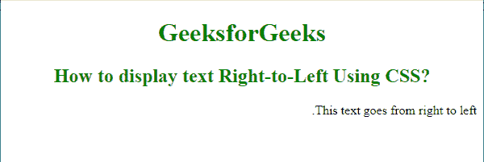
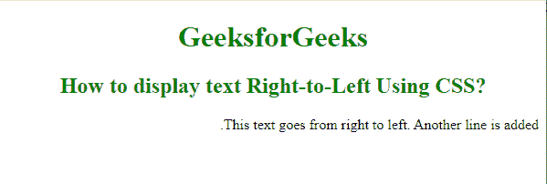

# 如何使用 CSS 从右向左显示文本？

> 原文:[https://www . geesforgeks . org/how-display-text-从右向左使用-css/](https://www.geeksforgeeks.org/how-to-display-text-right-to-left-using-css/)

任务是使用 CSS 从右向左显示文本。这是借助 [**CSS Direction 属性**](https://www.geeksforgeeks.org/css-direction-property/) **完成的。**默认情况下，HTML 文档中的文本对齐方式设置为从左到右。要从右向左显示文本，我们只需将 direction 属性设置为“rtl”值。

**语法:**

```css
element_selector {
   direction: rtl;
} 
```

**例 1:**

## 超文本标记语言

```css
<!DOCTYPE html>
<html>

<head>
    <style>
        h1,
        h2 {
            color: green;
            text-align: center;
        }

        .rtl {
            direction: rtl;
        }
    </style>
</head>

<body>
    <h1>
        GeeksforGeeks
    </h1>

    <h2>
        How to display text 
        Right-to-Left Using CSS?
    </h2>

    <p class="rtl">
        This text goes from right to left.
    </p>
</body>

</html>
```

**输出:**



从右向左

**示例 2:** 在上面的代码中，如果我们在“p”元素中添加一些更多的文本内容，我们会得到以下输出。请注意两个结果中的效果。

## 超文本标记语言

```css
<!DOCTYPE html>
<html>

<head>
    <style>
        h1,
        h2 {
            color: green;
            text-align: center;
        }

        .rtl {
            direction: rtl;
        }
    </style>
</head>

<body>
    <h1>
        GeeksforGeeks
    </h1>

    <h2>
        How to display text Right-to-Left Using CSS?
    </h2>

    <p class="rtl">
        This text goes from right to left.
        Another line is added.
    </p>
</body>

</html>
```

**输出:**



从右向左