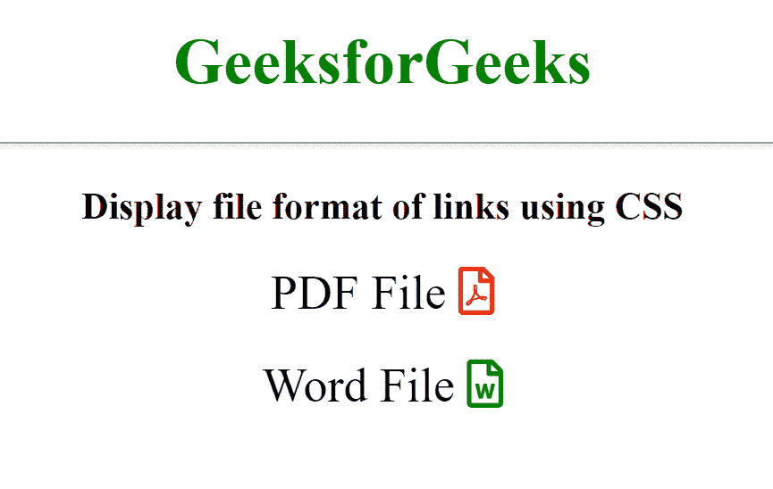

# 如何使用 CSS 显示链接的文件格式？

> 原文:[https://www . geesforgeks . org/如何使用 css 显示链接的文件格式/](https://www.geeksforgeeks.org/how-to-display-the-file-format-of-links-using-css/)

在本文中，我们将解释在网页上显示文件格式的方法。很多时候在浏览的时候，我们需要下载一个文档文件但是是 PDF 格式的，但是可能会出现一个问题，下载文件的多个链接都在那里，但是每个链接都包含不同的文件格式。一个可能包含文档文件，另一个可能包含 PDF 文件。我们不能只看链接就轻易知道哪个是哪个。

因此，为了解决这个问题，我们可以只使用一些 **CSS** 样式来公开我们网页中链接的文件格式。这是通过定位页面中链接的文件类型，并在选择器后使用【T2:】添加图标图像，并使用图标路径指定内容属性来完成的。它会自动在页面上找到的每个与文件扩展名匹配的合适链接上插入图标图像。

**语法:**

```html
[href$=" .file_extention "]::after {
  content: " " url( path_of_icon );
}
```

**示例:**本示例使用选择器后的**:显示文本后的文件格式图像。**

## 超文本标记语言

```html
<!DOCTYPE html>
<html>

<head>
    <title>
        How to Display file format
        of links using CSS?
    </title>

    <link rel="stylesheet" type="text/css"
href="//use.fontawesome.com/releases/v5.7.2/css/all.css">

    <style type="text/css">
        a {
            font-family: "Font Awesome 5 Free";
            text-decoration: none;
            font-size: 24px;
            color: black;
        }

        [href$=".pdf"]::after {
            content: '  \f1c1';
            color: red;
        }

        [href$=".docx"]::after {
            content: '  \f1c2';
            color: green;
        }
    </style>
</head>

<body style="text-align: center;">
    <h1 style="color: green;">
        GeeksforGeeks
    </h1>
    <hr>
    <h3>Display file format of links using CSS</h3>

    <a href="GeeksforGeeks.pdf">PDF File</a>
    <br><br>
    <a href="GeeksforGeeks.docx">Word File</a>

</body>

</html>
```

**输出:**

