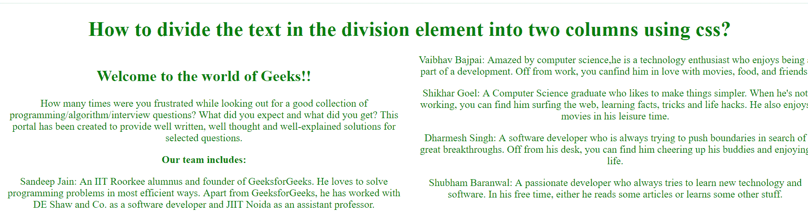

# 如何使用 CSS 将文本分为两列布局？

> 原文:[https://www . geesforgeks . org/如何将文本分成两列-布局-使用-css/](https://www.geeksforgeeks.org/how-to-divide-text-into-two-columns-layout-using-css/)

本文的目的是使用 CSS **列**属性将文本分成两列。此属性用于设置列数和这些列的宽度。

**语法:**

```css
columns: column-width columns-count | auto | initial | inherit;
```

**示例:**

## 超文本标记语言

```css

<!DOCTYPE html>
<html>

<head>
    <style>
        body {
            text-align: center;
            color: green;
        }

        .GFG {
            -webkit-columns: 40px 2;
            /* Chrome, Safari, Opera */
            -moz-columns: 60px 2;
            /* Firefox */
            columns: 60px 2;
        }
    </style>
</head>

<body>

    <h1>
        How to divide the text in the division
        element into two columns using css?
    </h1>

    <div class="GFG">
        <h2>Welcome to the world of Geeks!!</h2>
        How many times were you frustrated while
        looking out for a good collection of
        programming/algorithm/interview questions?
        What did you expect and what did you get?
        This portal has been created to provide well
        written, well thought and well-explained
        solutions for selected questions.

        <p>
            <strong>Our team includes:</strong>
        <p>
            Sandeep Jain: An IIT Roorkee alumnus
            and founder of GeeksforGeeks. He loves
            to solve programming problems in most
            efficient ways. Apart from GeeksforGeeks,
            he has worked with DE Shaw and Co. as a
            software developer and JIIT Noida as an
            assistant professor.
        </p>

        <p>
            Vaibhav Bajpai: Amazed by computer
            science, he is a technology enthusiast who
            enjoys being a part of a development. Off
            from work, you canfind him in love with
            movies, food, and friends.
        </p>

        <p>
            Shikhar Goel: A Computer Science graduate
            who likes to make things simpler. When he's
            not working, you can find him surfing the web,
            learning facts, tricks and life hacks.
            He also enjoys movies in his leisure time.
        </p>

        <p>
            Dharmesh Singh: A software developer who
            is always trying to push boundaries in search
            of great breakthroughs. Off from his desk,
            you can find him cheering up his buddies
            and enjoying life.
        </p>

        <p>
            Shubham Baranwal: A passionate developer
            who always tries to learn new technology and
            software. In his free time, either he reads
            some articles or learns some other stuff.
        </p>
    </div>
</body>

</html>                    
```

**输出:**



**支持的浏览器如下:**

*   谷歌 Chrome 43.0
*   Internet Explorer 10.0
*   Firefox 16.0
*   Opera 30.0
*   Safari 9.0