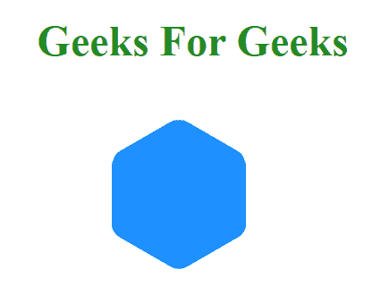
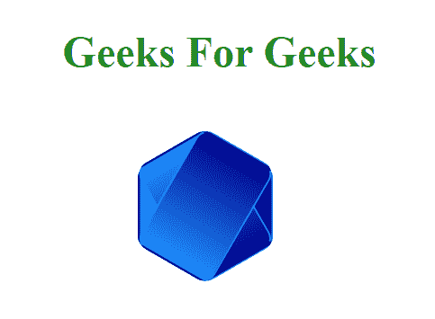

# 如何用 CSS 绘制曲线边六边形？

> 原文:[https://www . geeksforgeeks . org/如何使用-css/](https://www.geeksforgeeks.org/how-to-draw-a-curved-edge-hexagon-using-css/) 绘制曲线边-六边形

我们可以利用 CSS 的[伪元素属性](https://www.geeksforgeeks.org/css-pseudo-elements/)制作一个曲边六边形。

*   使用 div 元素创建一个矩形，并添加边框半径。
*   现在使用 CSS 创建一个伪元素，并使用 60 度旋转它。
*   之前也用 CSS 创建了另一个伪元素，旋转-60 度。

**示例 1:** 本示例使用 CSS 绘制曲线边六边形。

```css
<!DOCTYPE html>
<html>

<head>
    <title>
        Draw a Curved Edge
        Hexagon using CSS
    </title>

    <style>
        .hexagon {
            top: 30vh;
            left: 40%;
            position: absolute;
            margin: 0 auto;
            background-color: dodgerblue;
            border-radius: 10px;
            width: 100px; 
            height: 63px;
            box-sizing: border-box;
            transition: all 1s;
            border: 0.4vh solid transparent;
        }

        /* Creating pseudo-class */
        .hexagon:before, .hexagon:after {
            content: "";
            border: inherit;
            position: absolute;
            top: -0.5vh;
            left: -0.5vh;
            background-color: dodgerblue;
            border-radius: inherit;
            height: 100%;
            width: 100%;
        }

        /* Align them in such a way
        that they form a hexagon */
        .hexagon:before {
            transform: rotate(60deg);
        }
        .hexagon:after {
            transform: rotate(-60deg);
        }
    </style>
</head>

<body style="text-align: center;">
    <h1 style="color:forestgreen;">
        Geeks For Geeks
    </h1>

    <!-- Hexagon Division -->
    <div class="hexagon"
        id="hexagon">
    </div>
</body>

</html>
```

**输出:**


**例 2:** 如何用 CSS 绘制一个有一定效果的曲线边六边形。

```css
<!DOCTYPE html>
<html>

<head>
    <title>
        Draw a Curved Edge
        Hexagon using CSS
    </title>

    <style>
        .hexagon {
            top: 30vh;
            left: 40%;
            position: absolute;
            margin: 0 auto;

            /*To Add effect on the background*/
            background: linear-gradient(to left,
                       DarkBlue, DodgerBlue);
            border-radius: 10px;
            width: 100px; 
            height: 63px;
            box-sizing: border-box;
            transition: all 1s;
            border: 0.4vh solid transparent;
            border-top-color: dodgerblue;
            border-bottom-color: dodgerblue;
        }

        /*To create pseudo-class */
        .hexagon:before, .hexagon:after {
            content: "";
            border: inherit;
            position: absolute;
            top: -0.5vh;
            left: -0.5vh;

            /*To Add effect on the background*/
            background: linear-gradient(to left,
                    DarkBlue, DodgerBlue);
            border-radius: inherit;
            height: 100%;
            width: 100%;
        }

        /* Align them in such a way
        that they form a hexagon */
        .hexagon:before {
            transform: rotate(60deg);
        }
        .hexagon:after {
            transform: rotate(-60deg);
        }
    </style>
</head>

<body style="text-align:center;">
    <h1 style="color:forestgreen;">
        Geeks For Geeks
    </h1>

    <!-- Hexagon Division -->
    <div class="hexagon" id="hexagon"></div>
</body>

</html>
```

**输出:**
