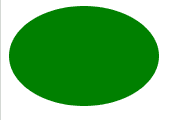

# 如何用 CSS 绘制椭圆？

> 原文:[https://www . geesforgeks . org/如何使用-css 绘制椭圆/](https://www.geeksforgeeks.org/how-to-draw-an-ellipse-using-css/)

在本文中，我们将学习如何使用 CSS 创建一个椭圆。为了创建一个椭圆，首先我们将创建一个简单的矩形我们想要的高度和宽度。

**创建矩形的方法:**为了创建一个我们想要的大小的椭圆，我们将在 HTML 中创建一个 div，并给它一个名为椭圆的类。现在我们将设置 div 的高度和宽度，它将看起来像一个矩形。我们可以根据自己的选择设置背景颜色。

下面是创建矩形的实现。

## 超文本标记语言

```html
<!DOCTYPE html>
<html>

<head>
    <!-- Adding CSS to the div -->
    <style>

        /* Setting Height and Width of Rectangle */
        .ellipse{
            height: 100px;
            width: 150px;
            background-color: green;
        }
    </style>
</head>

<body>

    <!-- Create a div -->
    <div class="ellipse"></div>
</body>

</html>
```

**输出:**


**矩形**

**从矩形创建椭圆的方法:**现在要将这个矩形转换为椭圆，我们将边框半径设置为一个非常高的值(50%到 100%)。它指的是形状拐角处的曲率。矩形的高度是椭圆的短轴，宽度是长轴。

## 超文本标记语言

```html
<!DOCTYPE html>
<html>

<head>

    <!-- Adding CSS to the div -->
    <style>

        /* Setting Height and Width of Rectangle */
        .ellipse{
            height: 100px;
            width: 150px;
            background-color: green;

            /* Setting Border Radius */
            border-radius: 50%;
        }
    </style>
</head>

<body>

    <!-- Create a div -->
    <div class="ellipse"></div>
</body>

</html>
```

**输出:**



**椭圆**