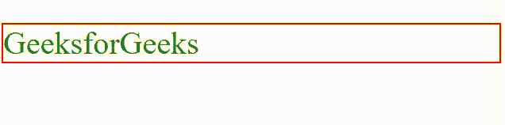

# 如何通过百分比 CSS 动态改变颜色？

> 原文:[https://www . geesforgeks . org/如何按百分比动态更改颜色-css/](https://www.geeksforgeeks.org/how-to-dynamically-change-color-by-percentage-css/)

在本文中，我们将学习如何通过百分比 CSS 动态改变颜色。

**方法:**我们可以使用 CSS 中的 [**滤镜**属性](https://www.geeksforgeeks.org/css-filter-property/)来动态改变任意元素的百分比颜色。滤镜属性的**亮度()**功能用于按百分比动态改变颜色。亮度函数采用百分比值来设置该颜色的亮度。

**语法:**

```css
filter: brightness(value);
```

**示例:**在下面的示例中，我们将元素的背景颜色设置为白色。但是当我们将鼠标悬停在段落上时，它的背景颜色会改变 50%，因为我们设置了一个过滤器，可以将段落的背景颜色改变 50%。

## 超文本标记语言

```css
<!DOCTYPE html>
<html lang="en">
<head>
    <title>Document</title>
    <style>
        .gfg{
            font-size: 40px;
            color: green;
            border: solid 2px red ;
            background-color: white;
        }
        p:hover{
            /* Change brightness */
            filter: brightness(50%);
        }
    </style>
</head>
<body>
    <p class="gfg">GeeksforGeeks</p>

</body>
</html>
```

**输出:**
