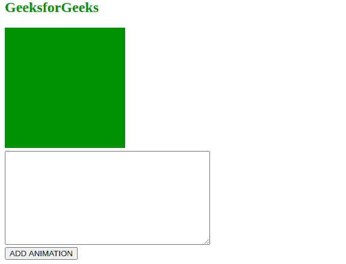

# 如何动态创建“@-关键帧”CSS 动画？

> 原文:[https://www . geesforgeks . org/如何动态创建关键帧-CSS-动画/](https://www.geeksforgeeks.org/how-to-dynamically-create-keyframe-css-animations/)

为了给我们的 HTML 网页动态分配关键帧动画，我们将使用 CSS 样式表 **insertRule()** 方法。我们将从文本区域获取关键帧动画，然后将这些规则应用于我们的网页。

**insertRule()方法:**这个方法是用来在当前的 CSS 样式表中插入一些新的 CSS 规则(绑定了一些限制)。

**语法:**

```css
stylesheet.insertRule(rule [, index])
```

**参数:**该方法接受两个参数，如上所述，如下所述:

*   **规则:**一个 DOMstring，本质上是要插入的 CSS 规则。

*   **索引(可选):**在 CSS 样式表中插入规则的索引

**示例:**

*   **HTML:** 首先，让我们使用 HTML 和 CSS 来制作页面的布局结构。

    ## 超文本标记语言

    ```css
    <!DOCTYPE html>
    <html lang="en">
    <head>
      <meta charset="UTF-8">
      <meta name="viewport" 
            content="width=device-width, 
                     initial-scale=1.0">
    </head>
    <body>
      <h2 style="color: green;">GeeksforGeeks</h2>
      <div id="element"></div>
      <form id="input">
        <textarea id="text" rows="10" cols="40"></textarea><br>
        <button type="submit">ADD ANIMATION</button>
      </form>
      <style>
        #element{
          width: 200px;
          height: 200px;
          background-color: green;
          margin-bottom: 5px;
        }
      </style>
    </body>
    ```

*   **输出:**结构会是这样的。
*   **JavaScript:** 现在，我们将在上面的文本区域输入一个关键帧动画，并将其添加到我们创建的元素中。

    ## 爪哇描述语言

    ```css
    // Javascript code to add keyframes
    let styleSheet = null;
    dynamicAnimation = (name,styles) => {
    // Creating a style element
    // To add the keyframes
    if (!styleSheet){
      styleSheet = document.createElement('style');
      styleSheet.type = 'text/css';
      document.head.appendChild(styleSheet);
    }
    // Adding The Keyframes
    styleSheet.sheet.insertRule(`@keyframes ${name} {${styles}}`,
    styleSheet.length
    );
    }

    const form = document.getElementById("input");
    const text = document.getElementById("text");
    form.addEventListener('submit', (e)=>{
      e.preventDefault()
      // Adding an animation
      // NewAnimation, with the 
      // Keyframes to the Stylesheet
      dynamicAnimation('newAnimation', text.value);
      // Timing and duration can be altered
      // As per user requirements
      document.getElementById("element").style.animation = 
      'newAnimation 3s infinite';
    });
    ```

**实施代码:**

## 超文本标记语言

```css
<!DOCTYPE html>
<html lang="en">
<head>
  <meta charset="UTF-8">
  <meta name="viewport" 
        content="width=device-width, 
        initial-scale=1.0">
</head>
<body>
  <h2 style="color: green;">GeeksforGeeks</h2>
  <div id="element"></div>
  <form id="input">
    <textarea id="text" rows="10" cols="40"></textarea><br>
    <button type="submit">ADD ANIMATION</button>
  </form>
  <style>
    #element{
      width: 200px;
      height: 200px;
      background-color: green;
      margin-bottom: 5px;
    }
  </style>
  <script>
    let styleSheet = null;
    dynamicAnimation = (name,styles) => {
    if (!styleSheet){
      styleSheet = document.createElement('style');
      styleSheet.type = 'text/css';
      document.head.appendChild(styleSheet);
    }

    styleSheet.sheet.insertRule(`@keyframes ${name} {${styles}}`,
    styleSheet.length
    );
    }

    const form = document.getElementById("input");
    const text = document.getElementById("text");
    form.addEventListener('submit', (e)=>{
      e.preventDefault();
      console.log("submitted");
      console.log(text.value);

      dynamicAnimation('newAnimation', text.value);
      document.getElementById("element").style.animation = 
                                'newAnimation 3s infinite';
    });
  </script>
</body>
</html>
```

CSS:现在，我们将向文本框元素添加以下关键帧规则集。

## 半铸钢ˌ钢性铸铁(Cast Semi-Steel)

```css
25%{
    transform : translateX(25%);
    border-radius : 25%;
   }
50%{
    transform : translateX(50%);
    border-radius : 50%;
   }
75%{
    transform : translateX(25%);
    border-radius : 25%;
}
100%{
    transform : translateX(0%);
    border-radius : 0%;
}
```

**输出:**

*   **提交关键帧前:**

    

*   **提交关键帧后:**

    