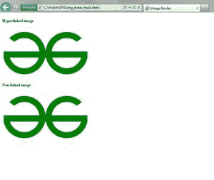

# 如何用 CSS 消除链接图片周围的蓝色边框？

> 原文:[https://www . geeksforgeeks . org/如何使用-css/](https://www.geeksforgeeks.org/how-to-eliminate-blue-border-around-linked-images-using-css/) 消除链接图像周围的蓝色边框

当您向图像添加超链接时，一些旧浏览器会通过在图像周围自动添加蓝色边框来呈现超链接图像。这种行为类似于使用蓝色下划线和字体颜色来突出显示超链接文本。虽然大多数现代浏览器像 Chrome、Edge、火狐等。默认情况下，不要在图像周围显示任何边框。

对于上下文，这是 internet explorer 呈现超链接图像的方式:

> [](”https://www.geeksforgeeks.org/”)


**方法:**我们可以通过定义自己的边框或者使用 css 完全移除来移除这个默认行为。我们可以使用 css 类或 id 选择特定的图像，要选择所有超链接图像，我们将使用父子 css 选择器。要了解更多关于 css 语法和选择器的信息，请阅读[这篇](https://www.geeksforgeeks.org/css-syntax-and-selectors/)。您可以使用选择器“a img”选择所有超链接图像，这将选择< a >标签内的所有< img >。

**方法 1:** 一种方法是定义我们自己的边界，这样我们就可以覆盖默认的边界。我们将在样式表中添加以下内容来更改所有超链接图像。

**语法:**

```html
a img {
    border: 4px dashed darkgreen;
}
```

## 超文本标记语言

```html
<!DOCTYPE html>
<html lang="en">

<head>
    <title>Image Border</title>
    <style>
    a img {
        border: 4px dashed darkgreen;
    }
    </style>
</head>

<body>
    <h5>Hyperlinked image</h5>
    <a href="https://www.geeksforgeeks.org/"> 
     </a>
    <h5>Non linked image</h5>
    
</body>

</html>
```

**输出:**


自定义边框

**方法 2:** 删除默认样式。

我们可以使用以下任何一种 CSS 样式删除超链接图像的默认浏览器样式。

**语法:**

```html
a img {
    border: none;
    /* border-width: 0; */
    /* border-style: none; */
}
```

## 超文本标记语言

```html
<!DOCTYPE html>
<html lang="en">

<head>
    <title>Image Border</title>
    <style>
    a img {
        border: none;
        /* border-width: 0; */
        /* border-style: none; */
    }
    </style>
</head>

<body>
    <h5>Hyperlinked image</h5>
    <a href="https://www.geeksforgeeks.org/"> 
         
    </a>
    <h5>Non linked image</h5> 
    
</body>

</html>
```

**输出:**



默认样式已删除