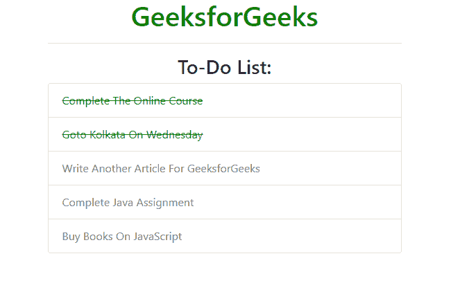

# 如何从 CSS 选择器中排除特定类名？

> 原文:[https://www . geesforgeks . org/如何从 css 选择器中排除特定类名/](https://www.geeksforgeeks.org/how-to-exclude-particular-class-name-from-css-selector/)

在 CSS 中，为了排除某个特定的类，我们可以使用 **[伪类:not selector](https://www.geeksforgeeks.org/css-not-selector/)** 又称**否定伪类**或 **not selector** 。该选择器用于为不是由给定选择器指定的每个元素设置样式。因为它用于防止特定项目出现在选定项目列表中。

**语法:**

```
:not(element) {
    // CSS Property
}
```

**示例:**

```
<!DOCTYPE html> 
<html> 

<head> 
    <title>
        How to exclude particular class
        name from CSS selector ?
    </title> 

    <meta charset="utf-8"> 
    <meta name="viewport" content=
            "width=device-width, initial-scale=1"> 

    <link rel="stylesheet" href= 
"https://maxcdn.bootstrapcdn.com/bootstrap/4.3.1/css/bootstrap.min.css"> 

    <style> 
        h1, h3 {
            text-align: center; 
        }
        .todo {
            color: gray;
        }

        /* Style to all li element except todo class name */
        li:not(.todo) {
            text-decoration: line-through;
            color: green;
        }
    </style> 
</head> 

<body> 
    <div class="container"> 

        <h1 class="text-success">
            GeeksforGeeks
        </h1> 
        <hr/> 

        <h3>To-Do List:</h3>

        <ul class="list-group">
            <li class="list-group-item">
                Complete The Online Course
            </li> 

            <li class="list-group-item">
                Goto Kolkata On Wednesday
            </li>

            <li class="todo list-group-item">
                Write Another Article For GeeksforGeeks
            </li>

            <li class="todo list-group-item">
                Complete Java Assignment
            </li>

            <li class="todo list-group-item">
                Buy Books On JavaScript
            </li>     
        </ul>
    </div> 
</body> 

</html>
```

**输出:**


CSS 是网页的基础，通过设计网站和网络应用程序用于网页开发。你可以通过以下 [CSS 教程](https://www.geeksforgeeks.org/css-tutorials/)和 [CSS 示例](https://www.geeksforgeeks.org/css-examples/)从头开始学习 CSS。