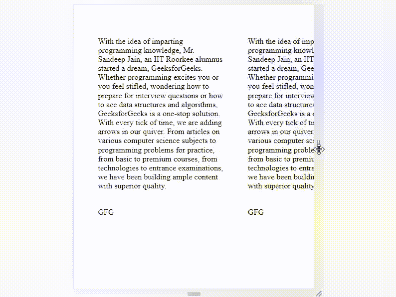
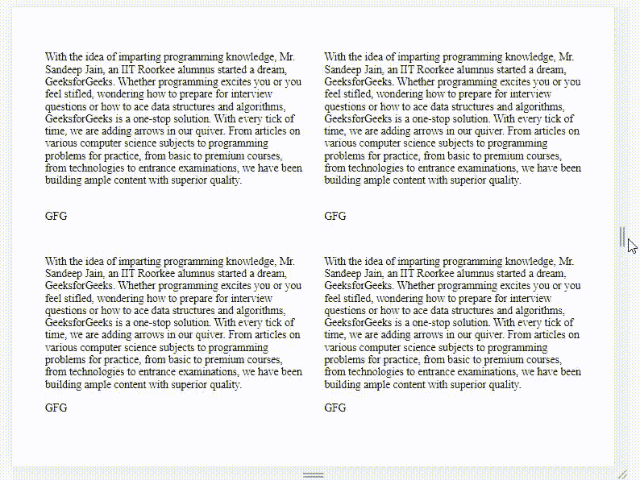

# 如何使用 CSS 根据屏幕大小动态拟合文本容器宽度？

> 原文:[https://www . geesforgeks . org/how-fit-text-container-width-dynamic-根据屏幕大小-使用-css/](https://www.geeksforgeeks.org/how-to-fit-text-container-width-dynamically-according-to-screen-size-using-css/)

在本文中，我们给出了一个文本段落，任务是使用 HTML 和 CSS 根据屏幕大小动态调整文本宽度。代码中使用的一些重要属性如下-

*   **显示-网格:**它帮助我们以网格结构显示页面上的内容。
*   **网格-间隙:**该属性设置两个网格之间的最小间隙量。
*   **自动适配:**取所需约束，根据屏幕大小适配内容。
*   **< div > :** 它是 division 标签，帮助我们定义 HTML 代码的特定部分，以便稍后在 CSS 样式表中可以轻松引用和编辑。
*   **自动适应:**它使屏幕上所有可用的列适应可用的空间，并根据需要扩展它们以占据行。
*   **min()和 max()函数:**该函数与定义函数特定范围的数学函数有很大关系，即大于或等于 min 且小于或等于 max。
*   **@media(最小宽度):**这是一个 CSS 属性，其中只有当最小屏幕宽度达到 950px 时，才会应用此标签下的条件。

**例 1:** 就是一个简单的例子。这里，我们将使用< div >标签来分别指定每个报价，并在 CSS 部分重复该功能。

## 超文本标记语言

```html
<!DOCTYPE html>
<html lang="en">

<head>
    <meta charset="UTF-8">
    <meta name="viewport" content=
        "width=device-width, initial-scale=1.0">

    <style>
        body {
            margin: 0;
            font-family: 'Nunito';
        }

        .top {
            padding: 3em;
            display: grid;
            grid-gap: 3em;
            grid-template-columns: repeat(4, 250px);
            .quote {
                padding: 3em;
                border-radius: .3em;
                box-shadow: 10px 10px 30px rgba(0, 0, 0, 0.1);
                p {
                    margin-top: 0;
                }
                span {
                    font-weight: bold;
                    position: relative;
                    margin-left: 20px;
                    &:before {
                        content: '';
                        position: absolute;
                        height: 1px;
                        width: 20px;
                        border-bottom: 1px solid black;
                        top: 20px;
                    }
                }
            }
        }

        @media(min-width:950px) {
            .top {
                grid-template-columns: repeat(4, 1fr);
            }
        }
    </style>

</head>

<body>
    <div class="top">
        <div class="quote">

            <p>
                With the idea of imparting programming 
                knowledge, Mr. Sandeep Jain, an IIT 
                Roorkee alumnus started a dream, 
                GeeksforGeeks. Whether programming 
                excites you or you feel stifled, wondering
                how to prepare for interview questions or
                how to ace data structures and algorithms,
                GeeksforGeeks is a one-stop solution. With 
                every tick of time, we are adding arrows
                in our quiver. From articles on various 
                computer science subjects to programming 
                problems for practice, from basic to 
                premium courses, from technologies to 
                entrance examinations, we have been 
                building ample content with superior quality.
            </p>
            <br>
            <span>GFG</span>
        </div>
        <div class="quote span-2">

            <p>
                With the idea of imparting programming 
                knowledge, Mr. Sandeep Jain, an IIT 
                Roorkee alumnus started a dream, 
                GeeksforGeeks. Whether programming 
                excites you or you feel stifled, wondering
                how to prepare for interview questions or
                how to ace data structures and algorithms,
                GeeksforGeeks is a one-stop solution. With 
                every tick of time, we are adding arrows
                in our quiver. From articles on various 
                computer science subjects to programming 
                problems for practice, from basic to 
                premium courses, from technologies to 
                entrance examinations, we have been 
                building ample content with superior quality.
            </p>
            <br>
            <span>GFG</span>
        </div>

        <div class="quote">
            <p>
                With the idea of imparting programming 
                knowledge, Mr. Sandeep Jain, an IIT 
                Roorkee alumnus started a dream, 
                GeeksforGeeks. Whether programming 
                excites you or you feel stifled, wondering
                how to prepare for interview questions or
                how to ace data structures and algorithms,
                GeeksforGeeks is a one-stop solution. With 
                every tick of time, we are adding arrows
                in our quiver. From articles on various 
                computer science subjects to programming 
                problems for practice, from basic to 
                premium courses, from technologies to 
                entrance examinations, we have been 
                building ample content with superior quality.
            </p>
            <span>GFG</span>
        </div>

        <div class="quote">
            <p>
                With the idea of imparting programming 
                knowledge, Mr. Sandeep Jain, an IIT 
                Roorkee alumnus started a dream, 
                GeeksforGeeks. Whether programming 
                excites you or you feel stifled, wondering
                how to prepare for interview questions or
                how to ace data structures and algorithms,
                GeeksforGeeks is a one-stop solution. With 
                every tick of time, we are adding arrows
                in our quiver. From articles on various 
                computer science subjects to programming 
                problems for practice, from basic to 
                premium courses, from technologies to 
                entrance examinations, we have been 
                building ample content with superior quality.
            </p>
            <span>GFG</span>
        </div>
    </div>
</body>

</html>
```

**输出:**

在最小化输出屏幕时，我们无法看到第二行的一半文本，并且在窗口底部有一个滚动条来滚动。这看起来不太好，如果用户在手机上查看网站，可能会带来麻烦。



**示例 2:** 这是一个更好的方法，因为它只添加了一个名为 auto fit 的属性，从而为我们提供了一个更有条理、更简单的输出。

## 超文本标记语言

```html
<!DOCTYPE html>
<!DOCTYPE html>
<html lang="en">

<head>
    <meta charset="UTF-8">
    <meta name="viewport" content=
        "width=device-width, initial-scale=1.0">

    <style>
        body {
            margin: 0;
            font-family: 'Nunito';
        }

        .top {
            padding: 3em;
            display: grid;
            grid-gap: 2em;
            grid-template-columns: repeat(
                    auto-fit, minmax(250px, 1fr));

            .quote {
                padding: 2em;
                border-radius: .3em;
                box-shadow: 10px 10px 30px 
                        rgba(0, 0, 0, 0.1);
                p {
                    margin-top: 0;
                }
                span {
                    font-weight: bold;
                    position: relative;
                    margin-left: 15px;
                    &:before {
                        content: '';
                        position: absolute;
                        height: 1px;
                        width: 10px;
                        border-bottom: 1px solid black;
                        top: 10px;
                        left: -15px;
                    }
                }
            }
        }
    </style>
</head>

<body>
    <div class="top">
        <div class="quote">
            <p>
                With the idea of imparting programming 
                knowledge, Mr. Sandeep Jain, an IIT 
                Roorkee alumnus started a dream, 
                GeeksforGeeks. Whether programming 
                excites you or you feel stifled, wondering
                how to prepare for interview questions or
                how to ace data structures and algorithms,
                GeeksforGeeks is a one-stop solution. With 
                every tick of time, we are adding arrows
                in our quiver. From articles on various 
                computer science subjects to programming 
                problems for practice, from basic to 
                premium courses, from technologies to 
                entrance examinations, we have been 
                building ample content with superior quality.
            </p>
            <br>
            <span>GFG</span>
        </div>

        <div class="quote span-2">
            <p>
                With the idea of imparting programming 
                knowledge, Mr. Sandeep Jain, an IIT 
                Roorkee alumnus started a dream, 
                GeeksforGeeks. Whether programming 
                excites you or you feel stifled, wondering
                how to prepare for interview questions or
                how to ace data structures and algorithms,
                GeeksforGeeks is a one-stop solution. With 
                every tick of time, we are adding arrows
                in our quiver. From articles on various 
                computer science subjects to programming 
                problems for practice, from basic to 
                premium courses, from technologies to 
                entrance examinations, we have been 
                building ample content with superior quality.
            </p>
            <br>
            <span>GFG</span>
        </div>

        <div class="quote">
            <p>
                With the idea of imparting programming 
                knowledge, Mr. Sandeep Jain, an IIT 
                Roorkee alumnus started a dream, 
                GeeksforGeeks. Whether programming 
                excites you or you feel stifled, wondering
                how to prepare for interview questions or
                how to ace data structures and algorithms,
                GeeksforGeeks is a one-stop solution. With 
                every tick of time, we are adding arrows
                in our quiver. From articles on various 
                computer science subjects to programming 
                problems for practice, from basic to 
                premium courses, from technologies to 
                entrance examinations, we have been 
                building ample content with superior quality.
            </p>
            <span>GFG</span>
        </div>

        <div class="quote">
            <p>
                With the idea of imparting programming 
                knowledge, Mr. Sandeep Jain, an IIT 
                Roorkee alumnus started a dream, 
                GeeksforGeeks. Whether programming 
                excites you or you feel stifled, wondering
                how to prepare for interview questions or
                how to ace data structures and algorithms,
                GeeksforGeeks is a one-stop solution. With 
                every tick of time, we are adding arrows
                in our quiver. From articles on various 
                computer science subjects to programming 
                problems for practice, from basic to 
                premium courses, from technologies to 
                entrance examinations, we have been 
                building ample content with superior quality.
            </p>
            <span>GFG</span>
        </div>
    </div>

</body>

</html>
```

**输出:**



在这个方法中，我们可以看到，在最小化屏幕时，所有的行都被调整为一列在另一列的下方。最后一个报价给了我们一个垂直滚动条。这里没有一行文字被省略，我们能够阅读整个报价。