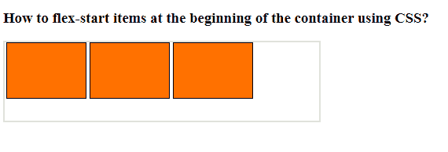

# 如何使用 CSS 在容器的开头灵活启动项目？

> 原文:[https://www . geesforgeks . org/how-flex-start-items-在容器开始时使用-css/](https://www.geeksforgeeks.org/how-to-flex-start-items-at-the-beginning-of-the-container-using-css/)

**调整内容**属性的**灵活开始**值允许您将项目放在容器的开始处。伸缩开始指示伸缩方向，而开始指示写入模式方向。允许父容器的子容器在父容器或 div 的开始处对齐。

遵循给定的步骤:

**1。创建 HTML 文件:**使用一个 id 为“GFG”的 div(根据您的选择)。里面有三块草皮。

**2。创建 CSS 文件:**将 div 的属性指定为

*   显示:flex
*   伸缩方向:行；
*   调整内容:弹性启动；

**示例:**

## 超文本标记语言

```css
<!DOCTYPE html>
<html>

<head>
    <style>
        #gfg {
            width: 400px;
            height: 100px;
            border: 2px solid #ddd;
            display: flex;
            justify-content: flex-start;
            flex-direction: row;
        }

        #gfg div {
            width: 100px;
            height: 70px;
            border: 1px solid black;
            margin: 0px 2px;
            background-color: #ff7100;
        }
    </style>
</head>

<body>
    <h3>
        How to flex-start items at the 
        beginning of the container 
        using CSS?
    </h3>

    <div id="gfg">
        <div></div>
        <div></div>
        <div></div>
    </div>
</body>

</html>
```

**输出:**

